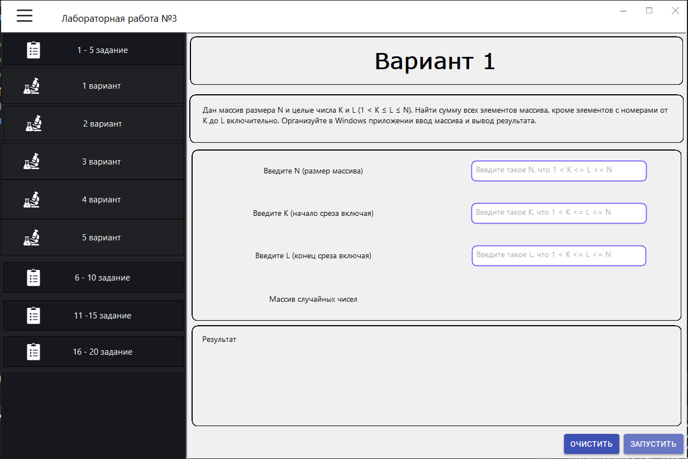

> [!NOTE]
> Условие данной лабораторной описано в файле PDF  

Здесь было реализовано полноценное приложение, где можно выбирать вариант и делать. 
Я не успею физически сделать все варианты, но попытался автоматизировать, чтобы все автоматически добавилось в приложение. 

Каков алгоритм добавления логики варианта: 
- Ищите в папке `Forms` свой вариант согласно английскому номеру
- Данная форма будет вашем `View` в паттерне `MVP`, там уже есть небольшие наброски
- Далее вы создаете свой `Presenter` в папке `Presenters`
- Далее вы создаете модель `Model` в папке `Models`
- Связываете все через интерфейсы, мы же проектируем на уровне интерфейсов, также правильно

В принципе все остальное будет готово, вам нужно реализовать только логику отдельного задания. 
Примеры смотрите у меня в проекте. Вызов и т.п. ничего менять не надо.

> [!NOTE]
> АХТУНГ! Могут проблемы с отрисовкой, автор - я - насрал полный унитаз говна, буду пытаться править  

АВТОР - Я - НЕ ДЕЛАЛ СУПЕР МАСШТАБИРУЕМОЕ ПРИЛОЖЕНИЕ, РАСКРЫТИЕ ЯЧЕЕК МОЖЕТ ЛОМАТЬСЯ

