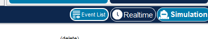
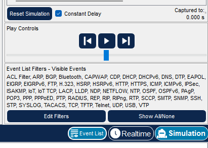
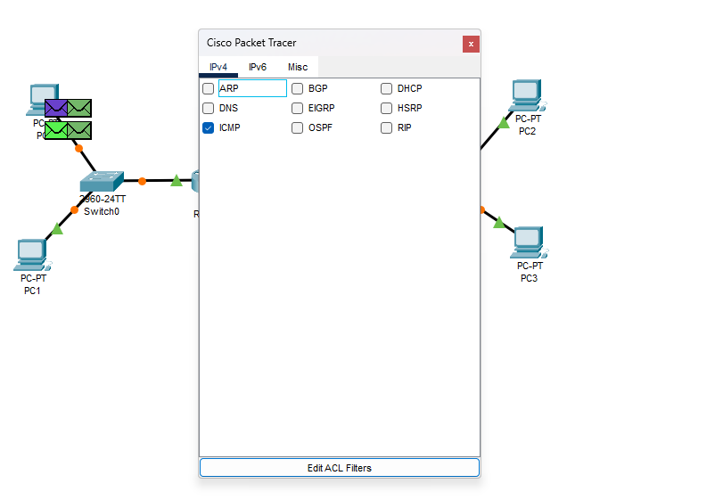
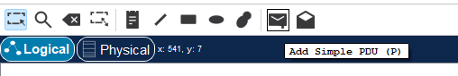
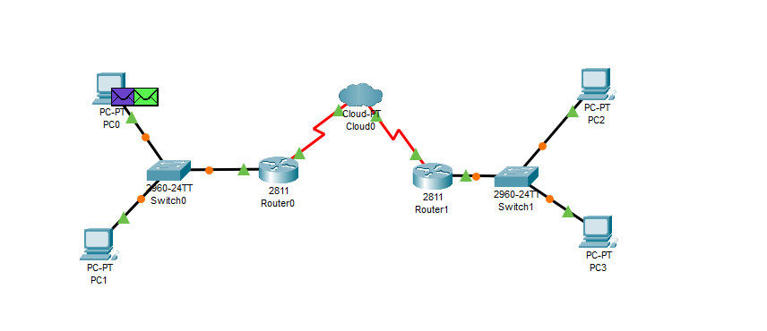
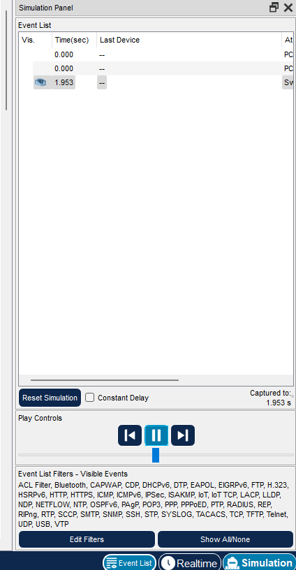
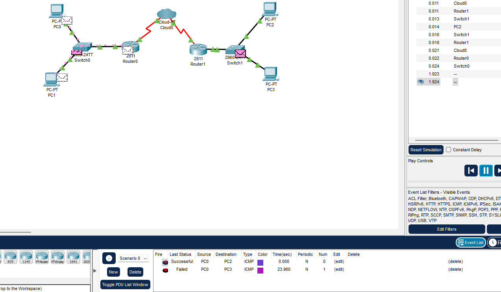

# 3 лабораторная работа 

> [!IMPORTANT]
> Перед выполнением нужно скачать `Cisco Packet Tracer`. Про его установку было расписано в предмете "Компьютерные сети".
> Перед запуском, чтобы все работало нужно выключать `WI-FI`. 

Выполнение лабораторной работы:

В начале включим режим симуляции, чтобы отслеживать как пакеты доходят от 1 ПК к другому ПК. 
Для этого нажмите на кнопку `Simulation` в правом нижнем углу, которая представлена ниже на рисунке. 

Теперь нажмите на кнопку `Edit Filters`, данная кнопка представлена ниже на рисунке. 

Теперь выберите конфигурацию, как ниже на фото. Нам нужны только `ICMP` пакеты. 

Теперь в левом верхнем углу нажимаем с помощью ЛКМ на конвертик, где будет подписано `Add Simple PDU`, на фото показано ниже как. 

Теперь нажмите просто с помощью лкм на PC0 и PC3, например. Это значит, что мы будем ждать, пока пакеты дойдут от `PC1` до `PC3`.

Теперь остается нажать только на кнопку запуск и ждать, когда будет все нормально. 

> [!IMPORTANT]
> Далеко не факт, что с 1 раза пакет дойдет. У `Cisco` есть особенность, что не с первого раза доходят пакеты. 
> Возможно, у вас получится только на 3 попытке и более, чтобы пакет дошел.
> Советую перед сдачей лабораторной 2 раза минимум запустить отправку `ICMP` пакетов от 1 пк к другому. 
> А при сдаче заново проделать операцию. 
> Если не получится, то укажите преподавателю, что это особенность `Cisco` и в условии к лабе об этом сказано, что не всегда с 1 попытки доходит. 

В каких-то случаях `Failed`, а где-то `Successful`. 

