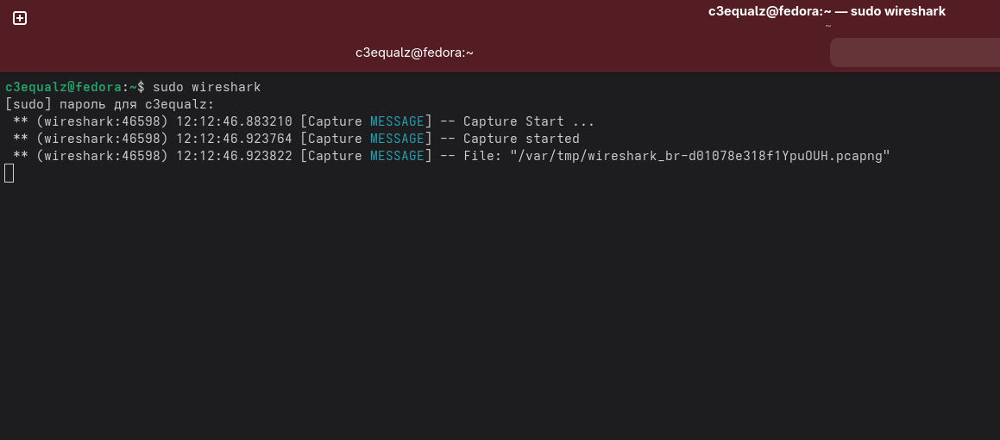

# 8 лабораторная работа

Для использования моей лабораторной работы понадобится `docker` и `linux`. 

> [!NOTE]
> У проекта `dockur` написано, что вроде поддержка `Windows` есть,
> но я абсолютно не понимаю как они собираются `KVM` под `Windows` запускать. 

В моем случае я буду использовать `Fedora Linux`. 

### Установка и настройка `wireshark`

Скачиваем: 

```bash
sudo dnf install wireshark
```

Выдаем доступ: 

```bash
sudo usermod -a -G wireshark c3equalz
```

Запускаем из-под сессии терминала:

```bash
sudo wireshark
```



После этого в `Wireshark` нужно будет выбрать устройство из-под которого все видно будет. Там будет трафик прыгать. 
В моем случае - это устройство `br-d01078e318f1`. 

### Установка и настройка `nmap`

```bash
sudo dnf install nmap
```

### Установка и настройка `docker` и `docker compose`

В моем случае я пользуюсь `Fedora`, мануал представлен здесь по ссылке [тык](https://docs.fedoraproject.org/en-US/quick-docs/installing-docker/)

### Выполнение лабораторной работы

Для запуска виртуальных машин используйте команду, которая представлена ниже:

```bash
docker compose up --build
```

> [!NOTE]
> При первом запуске лабы придется подождать минут 5 пока все настроится. 

> [!NOTE]
> Если выдает ошибку, то это значит вы неправильно поставили `docker compose` или же блокирует все `SELinux`. 
> Для отключения SELinux используем `sudo setenforce 0`.

### Выполнение лабораторной 

Для отправки `RST` на машину зомби нужно использовать команду, которая представлена ниже: 

```bash
sudo nmap -Pn -P 3390 --scanflags RST "192.168.1.11"
```

Для отправки `RST` на машину цели нужно использовать команду, которая представлена ниже: 

```bash
sudo nmap -Pn -P 3391 --scanflags RST "192.168.1.22"
```

Для отправки `SYNACK` на машину зомби нужно использовать команду, которая представлена ниже: 

```bash
sudo nmap -Pn -P 3390 --scanflags SYNACK "192.168.1.11"
```

Для отправки `SYNACK` на машину цели нужно использовать команду, которая представлена ниже: 

```bash
sudo nmap -Pn -P 3391 --scanflags SYNACK "192.168.1.22
```

Для того чтобы прочитать порты устройства с помощью метода зомби, нужно использовать команду, которая представлена ниже:

```bash
nmap -P0 -p- -sI "192.168.1.11" "192.168.1.22"
```
