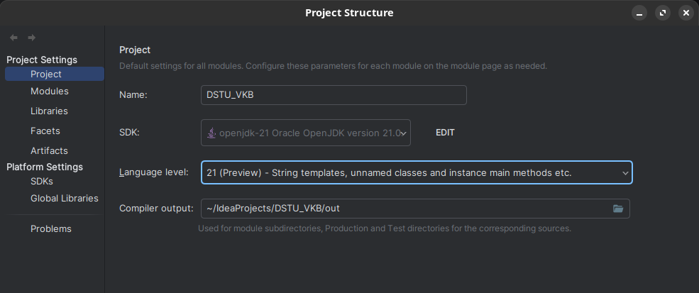

### Если хотите скопировать работы по Java:

**Используется система сборки Gradle и SDK OpenJDK 21 версии!!**

Работа с git в IDEA:

- https://youtu.be/8EDVDUQVrVA?si=AYOc3WRLpRB8dNic
- https://youtu.be/3S-ybO97U04?si=Uti3Eytz5wtWnKYr

---
Для установки gradle на Linux вам нужен sdkman.
Скопируйте команду ниже:

```bash
curl -s "https://get.sdkman.io" | bash
```

После установки sdkman скачайте Gradle (вместо 8.5 самую последнюю версию посмотрите)

```bash
sdk install gradle 8.5 
```

Вам IDEA должен предложить инициализировать Gradle проект, обязательно прожмите данные кнопки.
Параметры проекта:


Если вы на Windows, то у вас возможно будут проблемы с кодировкой. Мне помогло это:


