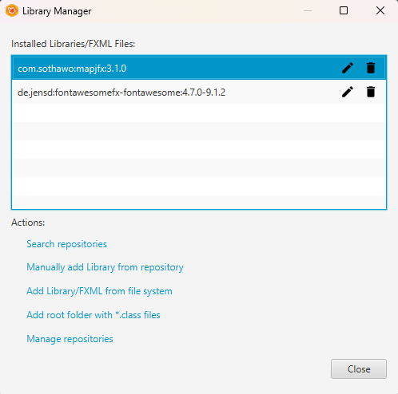
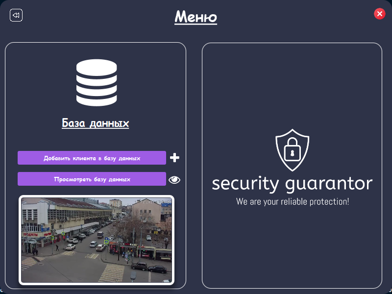
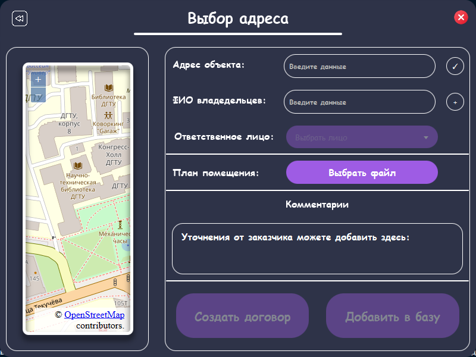

---
- Смотреть иконки здесь: https://icons8.com/icons/set/desktop или скачайте приложение https://icons8.com/app/windows

- Как установить MySQL и нужные компоненты: https://youtu.be/BxdSUGBs0gM?si=1gMyCdosJyI_mDHr

- Как установить зависимости для SceneBuilder: https://youtu.be/cvjUC5iAqr8?si=FW7H3_xLO3_vpwZ2

--- 

Логика моего приложения такая: 
1. Весь визуал завязан на FXML, для его обработки используйте Scene Builder.
2. Анимации в UI происходят с помощью CSS файлов, которые я прикрепляю в Scene Builder к каждому элементу. 
3. Управление элементами UI происходит в папке controllers, где я назначаю что делают определенные кнопки и т.п. 
4. Main - является сущностью приложения, там происходит запуск и конфигурация приложения. 

---
Для SceneBuilder будут нужны зависимости для карт и иконок.
Для установки создайте пустой FXML файл, а потом скачайте пакеты, которые представлены ниже.

---

---
Предметная область № 10: отдел вневедомственной охраны.

Отдел вневедомственной охраны (ОВО) занимается охраной объектов физических и юридических лиц. ОВО является коммерческим
подразделением милиции. Клиент, желающий обеспечить охрану своего имущества, обращается в ОВО и составляет договор охраны. 
В договоре оговариваются следующие моменты: адрес объекта; план расположения помещений; количество входов/выходов; 
расположение окон; список лиц, отвечающих за имущество; ответственное лицо от клиента, которое будет присутствовать в 
момент вскрытия помещения. После заключения договора объект подключается к сигнализации. 
В случае срабатывания сигнализации дежурный посылает патруль на осмотр объекта и сообщает ответственному лицу клиента о 
данном факте. Патруль, вместе с ответственным лицом клиента, осматривает объект, проверяет сохранность имущества и работу
сигнализации (в случае ложного срабатывания). После каждого выезда составляется акт, который является основанием для 
возбуждения уголовного дела относительно лиц, незаконно проникшим на объект. По результатам своей деятельности ОВО 
предоставляет отчетность в вышестоящие органы милицейского руководства.

