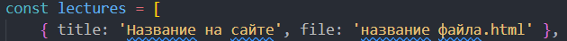
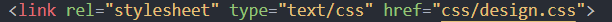
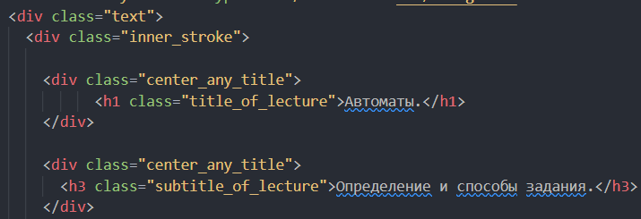

Документация

## Сайт сделан на фреймворке Tailwind css - https://tailwindcss.com/

Документация Tailwind css - https://tailwindcss.com/docs/installation

## Добавление лекций на сайт:

в файл script.js

Загружать новые лекции на сайт нужно в папку /lections файл script.js парсирует лекции именно из этой папки

## Добавление стилей к лекции ОБЯЗАТЕЛЬНО!!!

Для корректного отображение лекций на сайте нужно подключить внешние стили к файлам.html [design.css]

А так же обернуть содержимое лекции двумя контейнерами со стилем "text", "inner_stroke"

# Если стили отображаются не правильно нужно исправьт их путь!

Команда для запуска проекта - 'npm run dev'
Для запуска сайта используйте Live Server
