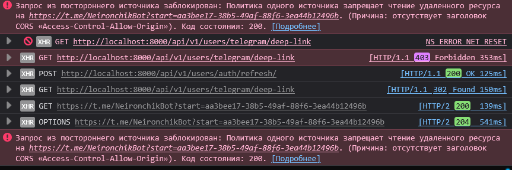

# Микросервис пользователей

В данном микросервисе находится логика работы с пользователями, а именно: 

- Регистрация
- Верификация пользователя
- Создание пользователя
- Удаление пользователя
- Обновление данных пользователя
- Чтение данных об одном пользователе
- Чтение данных всех пользователей

> [!IMPORTANT]
> Автор намеренно решил объединить данный микросервис с микросервисом аутентификации, чтобы упростить себе жизнь.
> В данном проекте не планируется использовать `API Gateway`, поэтому объединил все данные.

> [!NOTE]
> Если вам непонятна здесь архитектура, то советую перепрочитать `README.md` в корне данного проекта, а не `DSTU_VKB`

Данный микросервис активно общается с телеграмм ботом через `Kafka`, все события и действия приходят из брокера. 

--- 

### FAQ

#### Почему в случае перехода `Telegram` не делается `Redirect` на стороне `backend`.

Проблема наступает с `CORS`, в браузере выдается ошибка, как показано на фото ниже: 

`Telegram` не возвращает нужный заголовок из-за чего браузер не дает сделать `Redirect`. Но из-под консоли с `curl` все отлично, возвращается `HTML`. 