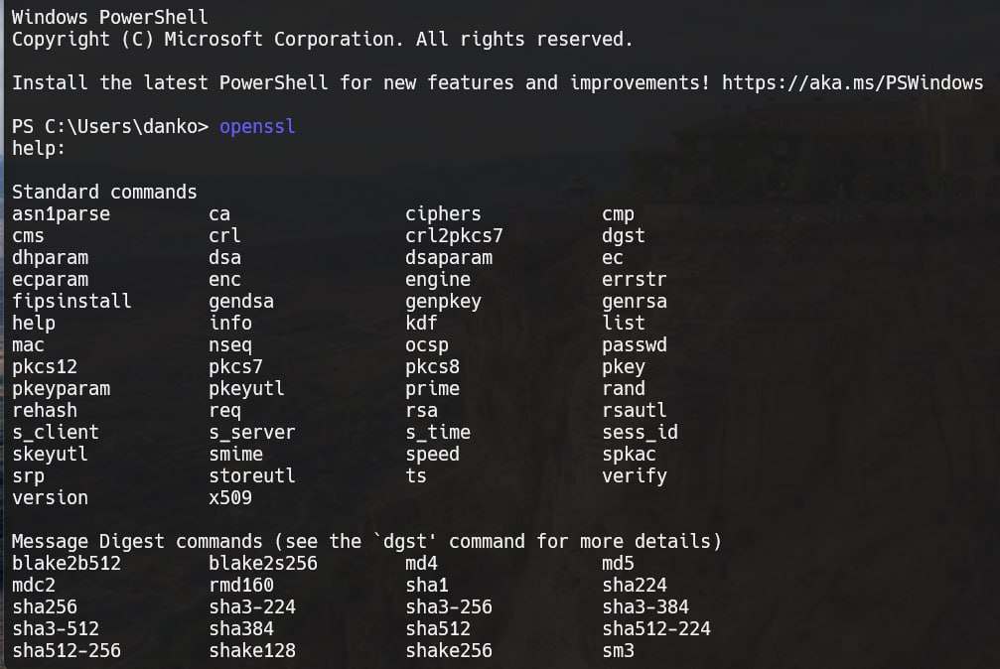

# Задание 1. 

## Условие 

Установите `Visual C++ 2008 Redistributables` и `OpenSSL` на компьютер. Запустите файл `openssl.exe` из папки `bin` в директории, куда установился
`OpenSSL`. Должно появиться окно с командной строкой `OpenSSL`, куда нужно будет вводить последующие команды. 

## Реализация 

Для установки на `Windows` я использовал - `https://slproweb.com/products/Win32OpenSSL.html`. 
Обязательно настройте, чтобы `OpenSSL` появился в переменной пути - `PATH`. 
Теперь можно будет работать через `PowerShell`. 

