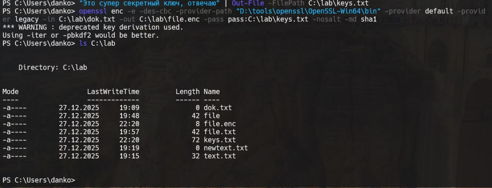
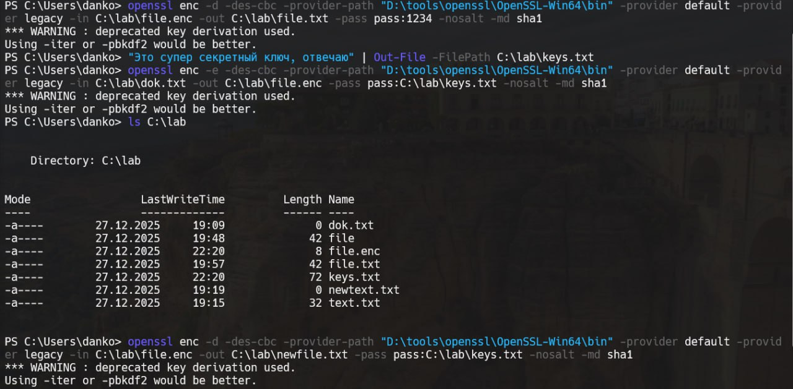

# Задание 10. 

## Условие

Зашифровать файл `file` с использованием алгоритма `DES` в режиме `CBC`, используя предоставленный в командной строке пароль для создания ключа,
без «соли», результат записать в файл `file.enc`. Расшифровать файл. Зашифруйте файл `dok.txt` используя парольную фразу из файла `key.txt`, без
«соли», результат записать в файл `file.enc`. Расшифровать файл `file.enc`, используя парольную фразу из указанного
файла, без соли, результат записать в файл `newfile.txt`.

## Реализация

Для выполнения задания нужно в начале создать наш абстрактный файл. Я его буду создавать также в директории `lab`. 
Используем команду, которая представлена ниже: 

```bash
ni C:\lab\file -ItemType File
```

Теперь зашифруем с помощью `DES`:

```bash
openssl enc -e -des-cbc -provider-path "D:\tools\openssl\OpenSSL-Win64\bin" -provider default -provider legacy -in C:\lab\file -out C:\lab\file.enc -pass pass:1234 -nosalt -md sha1
```

> [!IMPORTANT]
> Путь к provider-path может не совпадать, это я так ставил `openssl`
> Данные аргументы нужно указывать, так как `des-cbc` - это устаревший вариант. 

Для расшифровки с помощью `DES` можно использовать:

```bash
openssl enc -d -des-cbc -provider-path "D:\tools\openssl\OpenSSL-Win64\bin" -provider default -provider legacy -in C:\lab\file.enc -out C:\lab\file.txt -pass pass:1234 -nosalt -md sha1
```

Теперь создадим файл с паролем-фразой: 

```bash
"Это cупер секретный ключ, отвечаю" | Out-File -FilePath C:\lab\keys.txt
```

Теперь зашифруем: 

```bash
openssl enc -e -des-cbc -provider-path "D:\tools\openssl\OpenSSL-Win64\bin" -provider default -provider legacy -in C:\lab\dok.txt -out C:\lab\file.enc -pass pass:C:\lab\keys.txt -nosalt -md sha1
```



Теперь расшифруем файл file.enc, используя парольную фразу из `keys.txt`, без соли, результат записать в файл `newfile.txt`:

```bash
openssl enc -d -des-cbc -provider-path "D:\tools\openssl\OpenSSL-Win64\bin" -provider default -provider legacy -in C:\lab\file.enc -out C:\lab\newfile.txt -pass pass:C:\lab\keys.txt -nosalt -md sha1
```

