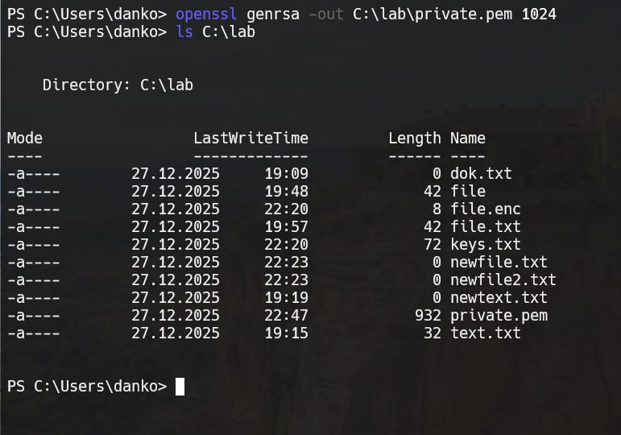
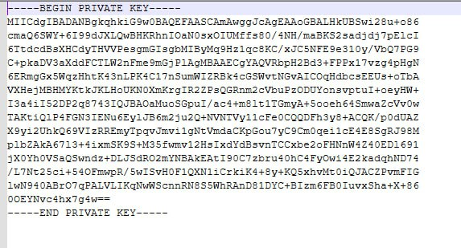
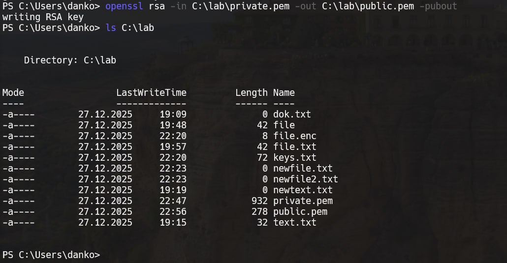
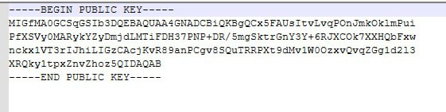
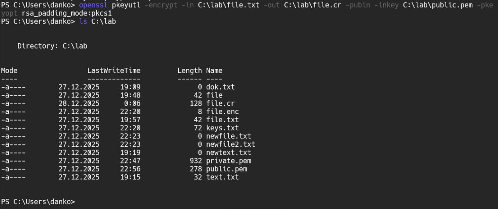
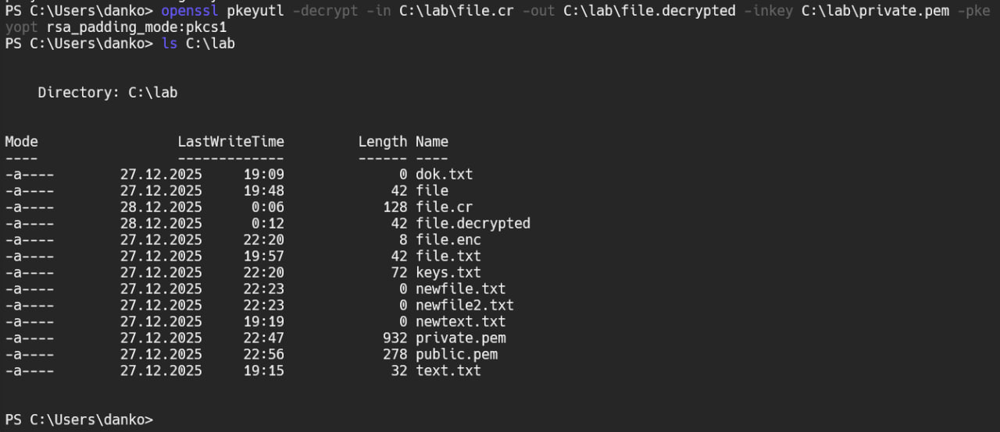
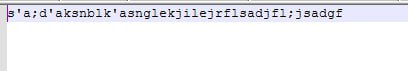

# Задание 11. 

## Условие

Изучение метода генерации ключей. Создание RSA-ключей, используя команду genrsa. Генерируем секретный
ключ RSA: openssl> genrsa -out с:\lab\private.pem 1024. Генерируем по готовому секретному ключу открытый ключ.
Шифрование данных с использованием открытого ключа RSA. Расшифруйте файл file.cr закрытым ключом RSA и сохраните его в
директории Е. Откройте файл newfile.txt и убедитесь в расшифровке файла file.cr. 

## Реализация

В начале создадим приватный ключ, для этого воспользуемся командой:

```bash
openssl genrsa -out C:\lab\private.pem 1024
```





Теперь сгенерируем открытый ключ, зная секретный ключ, для этого воспользуемся командой: 

```bash
openssl rsa -in C:\lab\private.pem -out C:\lab\public.pem -pubout
```





Теперь воспользуемся нашим файлом `file.txt`, для его шифрования воспользуемся командой, которая представлена ниже: 

```bash
openssl pkeyutl -encrypt -in C:\lab\file.txt -out C:\lab\file.cr -pubin -inkey C:\lab\public.pem -pkeyopt rsa_padding_mode:pkcs1
```



Попробуем открыть содержимое данного файла, результат представлен на фото ниже:


Теперь попробуем декодировать, для этого выполняем команду, которая представлена ниже:

```bash
openssl pkeyutl -decrypt -in C:\lab\file.cr -out C:\lab\file.decrypted -inkey C:\lab\private.pem -pkeyopt rsa_padding_mode:pkcs1
```





