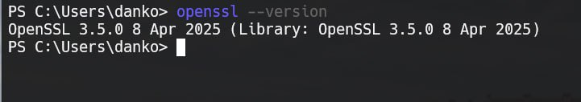

# Задание 2. 

## Условие

Определим используемую версию `OpenSSL`, с помощью опции `version`. 

## Реализация

В `Powershell` или аналогичной оболочке вбейте просто: 

```bash
openssl --version
```

Должно выйти то, что представлено на рисунке ниже

