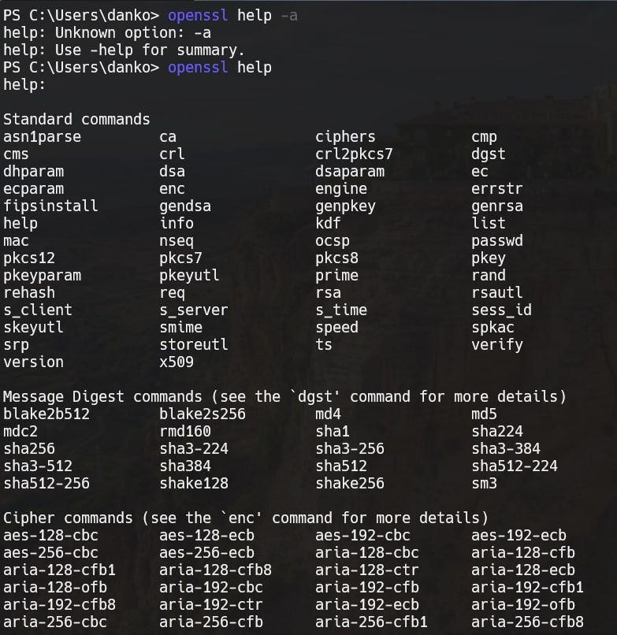

# Задание 4.

## Условие

Вывод на экран списка доступных команд с неправильным ключом: `OpenSSL> help или OpenSSL > help –h`.

## Реализация

Чтобы узнать возможные параметры: 

```bash
openssl help -a
```

> [!NOTE]
> Странная формулировка - неизвестный ключ... Ну результат все равно на фото

