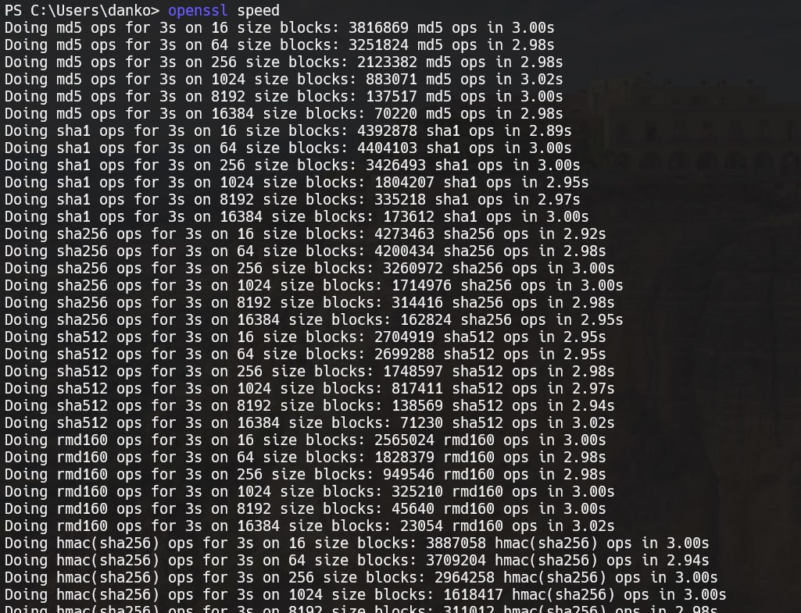

# Задание 7. 

## Условие

Команда для измерения производительности системы: `openssl> speed`.

## Реализация

Для выполнения задания используем команду, которая представлена ниже: 

```bash
openssl speed
```

