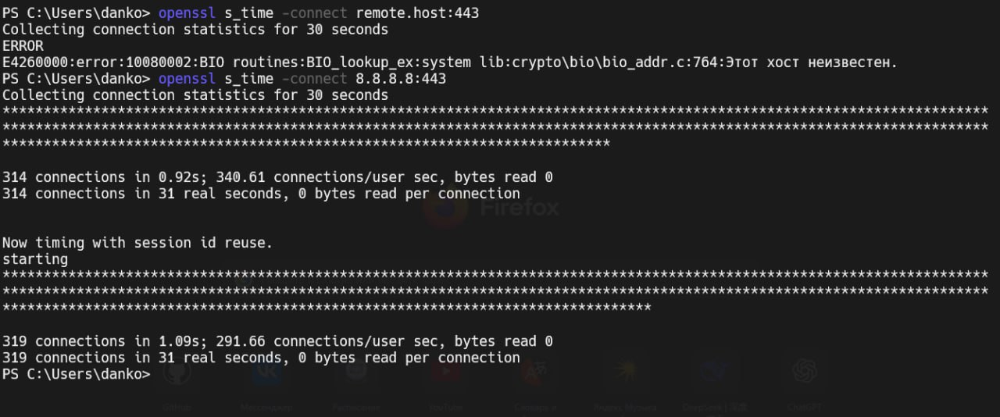

# Задание 8. 

## Условие

Команда для измерения производительности сетевого соединения: `openssl s_time -connect remote.host:443`

## Реализация

Для выполнения задания воспользуюсь хостом `Google`. Команда представлена ниже:

```bash
openssl s_time -connect 8.8.8.8:443
```

