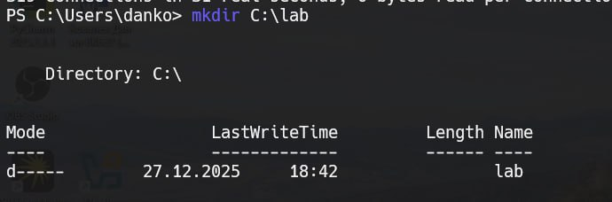
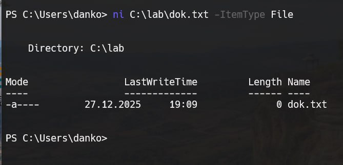
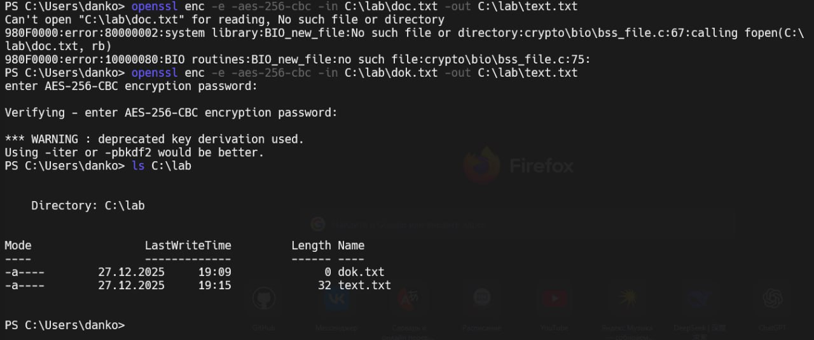
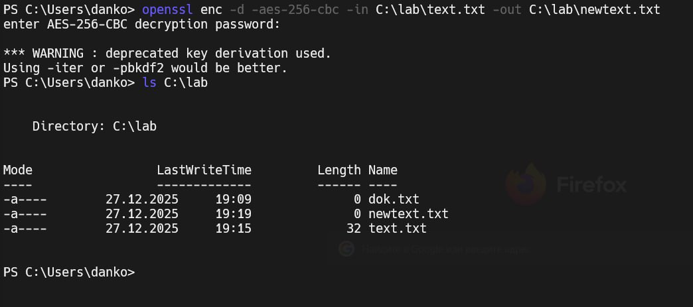
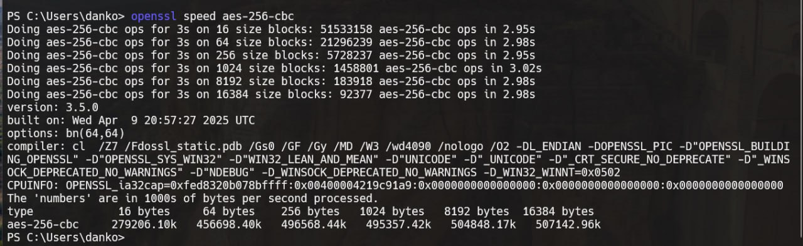

# Задание 9. 

## Условие

Создайте в директории `C` папку `lab` (для `ОС Linux` – домашний каталог). В папке `lab` создайте текстовый файл `dok.txt`.
Зашифруйте файл `dok.txt` используя алгоритм шифрования `AES` и сохраните его в `text.txt`. 
Дешифровать файл. Проверить скорость алгоритма `aes-256-cbc`. 

## Реализация

Создадим в директории `C:\` папку `lab`, для этого используем команду, которая представлена ниже: 

```bash
mkdir C:\lab
```



В папке `lab` теперь создадим текстовый файл `dok.txt`, для этого используем команду:

```bash
ni C:\lab\dok.txt -ItemType File
```



Зашифруем теперь файл:

```bash
openssl enc -e -aes-256-cbc -in C:\lab\dok.txt -out C:\lab\text.txt
```



> [!NOTE]
> В моем случае я задал пароль - `12345`. 

Теперь дешифруем файл, для этого используем команду: 

```bash
openssl enc -d -aes-256-cbc -in C:\lab\text.txt -out C:\lab\newtext.txt
```



Проверим теперь скорость `aes-256-cbc`, используя команду, которая представлена ниже: 

```bash
openssl speed aes-256-cbc
```

