# Задание 10. 

## Условие

Повторите действия 3-7 для алгоритма `des3` и `blowfish`.

## Практическая реализация

### Задание 3: Генерация ключей для DES3 и Blowfish

С помощью `OpenSSL` сгенерируйте ключи и векторы инициализации (IV) для алгоритмов `DES3` и `Blowfish`.

#### Генерация ключа и IV для DES3:

```bash
openssl rand -hex 24 > "D:\PycharmProjects\DSTU_VKB\methods_and_means_of_cryptographic_information_protection\docs\explanations\2\11\10\des3_key.txt"
openssl rand -hex 8 > "D:\PycharmProjects\DSTU_VKB\methods_and_means_of_cryptographic_information_protection\docs\explanations\2\11\10\des3_iv.txt"
```

> [!NOTE]
> DES3 требует ключ длиной 24 байта (192 бита) и IV длиной 8 байт (64 бита).

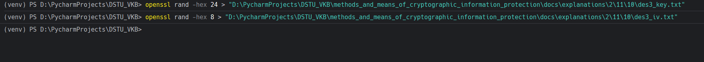

#### Генерация ключа и IV для Blowfish:

```bash
openssl rand -hex 32 > "D:\PycharmProjects\DSTU_VKB\methods_and_means_of_cryptographic_information_protection\docs\explanations\2\11\10\blowfish_key.txt"
openssl rand -hex 16 > "D:\PycharmProjects\DSTU_VKB\methods_and_means_of_cryptographic_information_protection\docs\explanations\2\11\10\blowfish_iv.txt"
```

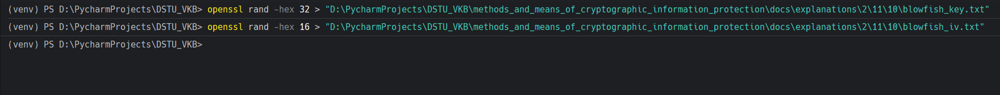

> [!NOTE]
> Blowfish поддерживает ключи от 4 до 56 байт. Используем 32 байта (256 бит) и IV длиной 16 байт (128 бит).

> [!IMPORTANT]
> Пути к файлам могут быть абсолютно иными, поменяйте на свой.

---

### Задание 4: Шифрование файла с помощью DES3 и Blowfish

С помощью `OpenSSL` примените сгенерированные ключи для шифрования текстового файла алгоритмами `DES3` и `Blowfish`. Измерьте время шифрования и запомните (запишите) его.

#### Шифрование файла алгоритмом DES3:

```bash
openssl enc -e -des3 -provider-path "D:\tools\openssl\OpenSSL-Win64\bin" -provider default -provider legacy -in "D:\PycharmProjects\DSTU_VKB\methods_and_means_of_cryptographic_information_protection\docs\explanations\2\11\10\plain.txt" -out "D:\PycharmProjects\DSTU_VKB\methods_and_means_of_cryptographic_information_protection\docs\explanations\2\11\10\plain_des3.enc" -K $(Get-Content "D:\PycharmProjects\DSTU_VKB\methods_and_means_of_cryptographic_information_protection\docs\explanations\2\11\10\des3_key.txt") -iv $(Get-Content "D:\PycharmProjects\DSTU_VKB\methods_and_means_of_cryptographic_information_protection\docs\explanations\2\11\10\des3_iv.txt") -nosalt
```

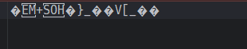

Для измерения времени шифрования DES3 в PowerShell:

```powershell
Measure-Command { openssl enc -e -des3 -provider-path "D:\tools\openssl\OpenSSL-Win64\bin" -provider default -provider legacy -in "D:\PycharmProjects\DSTU_VKB\methods_and_means_of_cryptographic_information_protection\docs\explanations\2\11\10\plain.txt" -out "D:\PycharmProjects\DSTU_VKB\methods_and_means_of_cryptographic_information_protection\docs\explanations\2\11\10\plain_des3.enc" -K $(Get-Content "D:\PycharmProjects\DSTU_VKB\methods_and_means_of_cryptographic_information_protection\docs\explanations\2\11\10\des3_key.txt") -iv $(Get-Content "D:\PycharmProjects\DSTU_VKB\methods_and_means_of_cryptographic_information_protection\docs\explanations\2\11\10\des3_iv.txt") -nosalt }
```

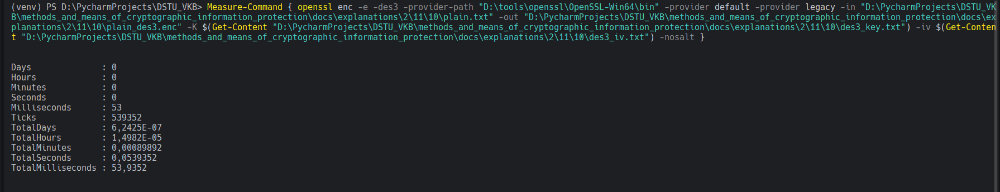

#### Шифрование файла алгоритмом Blowfish:

```bash
openssl enc -e -bf-cbc -provider-path "D:\tools\openssl\OpenSSL-Win64\bin" -provider default -provider legacy -in "D:\PycharmProjects\DSTU_VKB\methods_and_means_of_cryptographic_information_protection\docs\explanations\2\11\10\plain.txt" -out "D:\PycharmProjects\DSTU_VKB\methods_and_means_of_cryptographic_information_protection\docs\explanations\2\11\10\plain_blowfish.enc" -K $(Get-Content "D:\PycharmProjects\DSTU_VKB\methods_and_means_of_cryptographic_information_protection\docs\explanations\2\11\10\blowfish_key.txt") -iv $(Get-Content "D:\PycharmProjects\DSTU_VKB\methods_and_means_of_cryptographic_information_protection\docs\explanations\2\11\10\blowfish_iv.txt") -nosalt
```

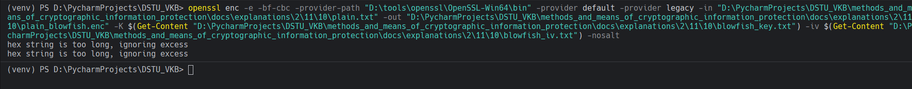

Для измерения времени шифрования Blowfish в PowerShell:

```powershell
Measure-Command { openssl enc -e -bf-cbc -provider-path "D:\tools\openssl\OpenSSL-Win64\bin" -provider default -provider legacy -in "D:\PycharmProjects\DSTU_VKB\methods_and_means_of_cryptographic_information_protection\docs\explanations\2\11\10\plain.txt" -out "D:\PycharmProjects\DSTU_VKB\methods_and_means_of_cryptographic_information_protection\docs\explanations\2\11\10\plain_blowfish.enc" -K $(Get-Content "D:\PycharmProjects\DSTU_VKB\methods_and_means_of_cryptographic_information_protection\docs\explanations\2\11\10\blowfish_key.txt") -iv $(Get-Content "D:\PycharmProjects\DSTU_VKB\methods_and_means_of_cryptographic_information_protection\docs\explanations\2\11\10\blowfish_iv.txt") -nosalt }
```


> [!IMPORTANT]
> У вас совершенно иные пути входных и выходных файлов.

---

### Задание 5: Проверка зашифрованных файлов

Откройте зашифрованные файлы, убедитесь, что содержимое не является семантически понятным.

#### Проверка файла, зашифрованного DES3:

Файл `plain_des3.enc` должен содержать бинарные данные, не читаемые в текстовом виде.

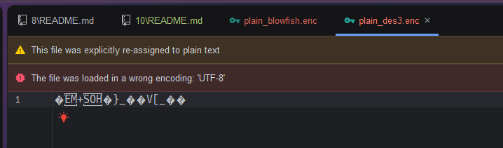

#### Проверка файла, зашифрованного Blowfish:

Файл `plain_blowfish.enc` должен содержать бинарные данные, не читаемые в текстовом виде.

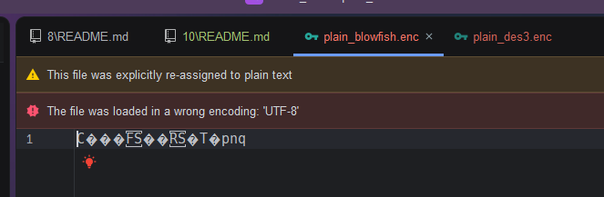

---

### Задание 6: Проверка с неправильным ключом

Убедитесь, что при использовании неправильного ключа текст не расшифровывается.

#### Попытка расшифрования DES3 с неправильным ключом:

Создайте неправильный ключ:

```bash
openssl rand -hex 24 > "D:\PycharmProjects\DSTU_VKB\methods_and_means_of_cryptographic_information_protection\docs\explanations\2\11\10\des3_wrong_key.txt"
```

Попытка расшифрования:

```bash
openssl enc -d -des3 -provider-path "D:\tools\openssl\OpenSSL-Win64\bin" -provider default -provider legacy -in "D:\PycharmProjects\DSTU_VKB\methods_and_means_of_cryptographic_information_protection\docs\explanations\2\11\10\plain_des3.enc" -out "D:\PycharmProjects\DSTU_VKB\methods_and_means_of_cryptographic_information_protection\docs\explanations\2\11\10\plain_des3_wrong.txt" -K $(Get-Content "D:\PycharmProjects\DSTU_VKB\methods_and_means_of_cryptographic_information_protection\docs\explanations\2\11\10\des3_wrong_key.txt") -iv $(Get-Content "D:\PycharmProjects\DSTU_VKB\methods_and_means_of_cryptographic_information_protection\docs\explanations\2\11\10\des3_iv.txt") -nosalt
```

> [!NOTE]
> Эта команда должна выдать ошибку или расшифрованный файл будет содержать мусор.


#### Попытка расшифрования Blowfish с неправильным ключом:

Создайте неправильный ключ:

```bash
openssl rand -hex 32 > "D:\PycharmProjects\DSTU_VKB\methods_and_means_of_cryptographic_information_protection\docs\explanations\2\11\10\blowfish_wrong_key.txt"
```

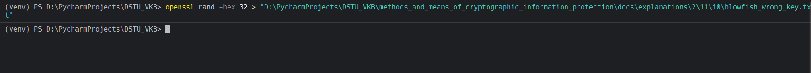

Попытка расшифрования:

```bash
openssl enc -d -bf-cbc -provider-path "D:\tools\openssl\OpenSSL-Win64\bin" -provider default -provider legacy -in "D:\PycharmProjects\DSTU_VKB\methods_and_means_of_cryptographic_information_protection\docs\explanations\2\11\10\plain_blowfish.enc" -out "D:\PycharmProjects\DSTU_VKB\methods_and_means_of_cryptographic_information_protection\docs\explanations\2\11\10\plain_blowfish_wrong.txt" -K $(Get-Content "D:\PycharmProjects\DSTU_VKB\methods_and_means_of_cryptographic_information_protection\docs\explanations\2\11\10\blowfish_wrong_key.txt") -iv $(Get-Content "D:\PycharmProjects\DSTU_VKB\methods_and_means_of_cryptographic_information_protection\docs\explanations\2\11\10\blowfish_iv.txt") -nosalt
```

> [!NOTE]
> Эта команда должна выдать ошибку или расшифрованный файл будет содержать мусор.

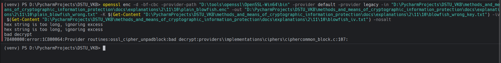

> [!IMPORTANT]
> У вас совершенно иные пути к файлам.

---

### Задание 7: Расшифрование правильным ключом

Убедитесь, что при использовании правильного ключа текст расшифровывается корректно (расшифрованный текст совпадает с исходным).

#### Расшифрование DES3 правильным ключом:

```bash
openssl enc -d -des3 -provider-path "D:\tools\openssl\OpenSSL-Win64\bin" -provider default -provider legacy -in "D:\PycharmProjects\DSTU_VKB\methods_and_means_of_cryptographic_information_protection\docs\explanations\2\11\10\plain_des3.enc" -out "D:\PycharmProjects\DSTU_VKB\methods_and_means_of_cryptographic_information_protection\docs\explanations\2\11\10\plain_des3_good.txt" -K $(Get-Content "D:\PycharmProjects\DSTU_VKB\methods_and_means_of_cryptographic_information_protection\docs\explanations\2\11\10\des3_key.txt") -iv $(Get-Content "D:\PycharmProjects\DSTU_VKB\methods_and_means_of_cryptographic_information_protection\docs\explanations\2\11\10\des3_iv.txt") -nosalt
```

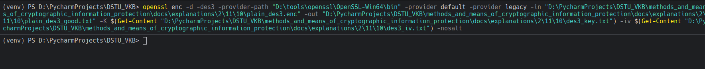


Для измерения времени расшифрования DES3:

```powershell
Measure-Command { openssl enc -d -des3 -provider-path "D:\tools\openssl\OpenSSL-Win64\bin" -provider default -provider legacy -in "D:\PycharmProjects\DSTU_VKB\methods_and_means_of_cryptographic_information_protection\docs\explanations\2\11\10\plain_des3.enc" -out "D:\PycharmProjects\DSTU_VKB\methods_and_means_of_cryptographic_information_protection\docs\explanations\2\11\10\plain_des3_good.txt" -K $(Get-Content "D:\PycharmProjects\DSTU_VKB\methods_and_means_of_cryptographic_information_protection\docs\explanations\2\11\10\des3_key.txt") -iv $(Get-Content "D:\PycharmProjects\DSTU_VKB\methods_and_means_of_cryptographic_information_protection\docs\explanations\2\11\10\des3_iv.txt") -nosalt }
```

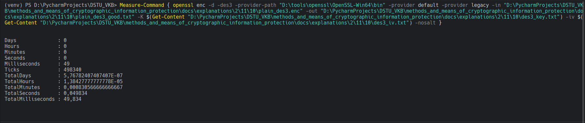

#### Расшифрование Blowfish правильным ключом:

```bash
openssl enc -d -bf-cbc -provider-path "D:\tools\openssl\OpenSSL-Win64\bin" -provider default -provider legacy -in "D:\PycharmProjects\DSTU_VKB\methods_and_means_of_cryptographic_information_protection\docs\explanations\2\11\10\plain_blowfish.enc" -out "D:\PycharmProjects\DSTU_VKB\methods_and_means_of_cryptographic_information_protection\docs\explanations\2\11\10\plain_blowfish_good.txt" -K $(Get-Content "D:\PycharmProjects\DSTU_VKB\methods_and_means_of_cryptographic_information_protection\docs\explanations\2\11\10\blowfish_key.txt") -iv $(Get-Content "D:\PycharmProjects\DSTU_VKB\methods_and_means_of_cryptographic_information_protection\docs\explanations\2\11\10\blowfish_iv.txt") -nosalt
```

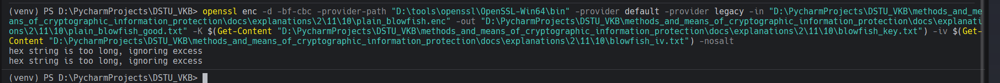

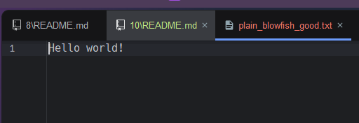

Для измерения времени расшифрования Blowfish:

```powershell
Measure-Command { openssl enc -d -bf-cbc -provider-path "D:\tools\openssl\OpenSSL-Win64\bin" -provider default -provider legacy -in "D:\PycharmProjects\DSTU_VKB\methods_and_means_of_cryptographic_information_protection\docs\explanations\2\11\10\plain_blowfish.enc" -out "D:\PycharmProjects\DSTU_VKB\methods_and_means_of_cryptographic_information_protection\docs\explanations\2\11\10\plain_blowfish_good.txt" -K $(Get-Content "D:\PycharmProjects\DSTU_VKB\methods_and_means_of_cryptographic_information_protection\docs\explanations\2\11\10\blowfish_key.txt") -iv $(Get-Content "D:\PycharmProjects\DSTU_VKB\methods_and_means_of_cryptographic_information_protection\docs\explanations\2\11\10\blowfish_iv.txt") -nosalt }
```

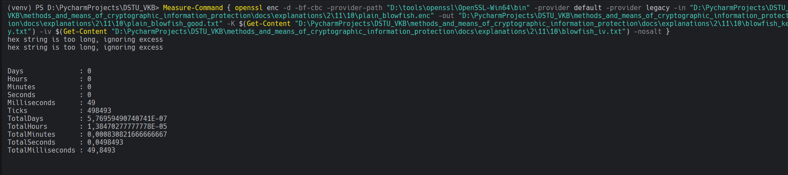

> [!IMPORTANT]
> У вас совершенно иные пути могут быть.

#### Проверка совпадения исходного и расшифрованных файлов:

В PowerShell для DES3:

```powershell
Get-FileHash "D:\PycharmProjects\DSTU_VKB\methods_and_means_of_cryptographic_information_protection\docs\explanations\2\11\10\plain.txt" -Algorithm SHA256
Get-FileHash "D:\PycharmProjects\DSTU_VKB\methods_and_means_of_cryptographic_information_protection\docs\explanations\2\11\10\plain_des3_good.txt" -Algorithm SHA256
```

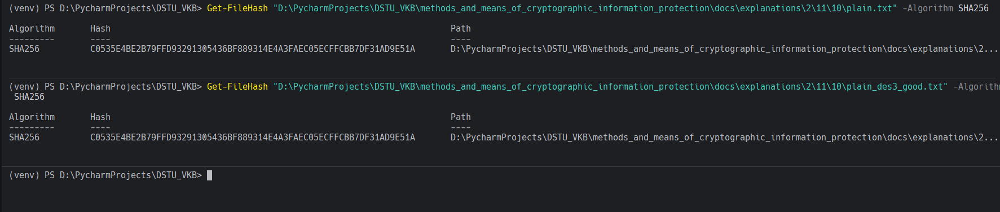

В PowerShell для Blowfish:

```powershell
Get-FileHash "D:\PycharmProjects\DSTU_VKB\methods_and_means_of_cryptographic_information_protection\docs\explanations\2\11\10\plain.txt" -Algorithm SHA256
Get-FileHash "D:\PycharmProjects\DSTU_VKB\methods_and_means_of_cryptographic_information_protection\docs\explanations\2\11\10\plain_blowfish_good.txt" -Algorithm SHA256
```

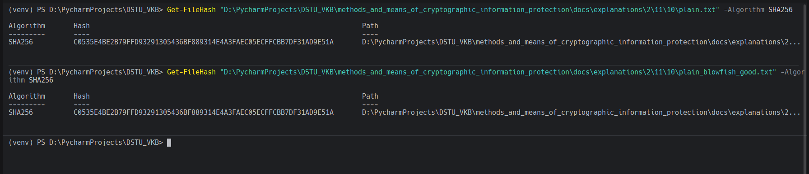

Если файлы идентичны, хеши будут совпадать.
