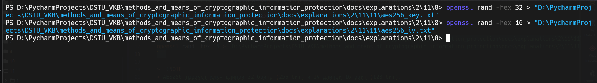
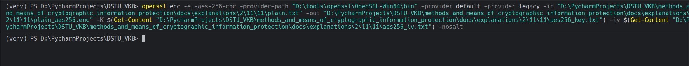
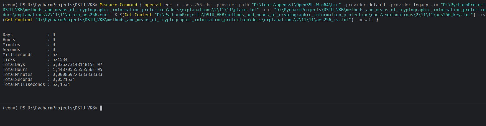
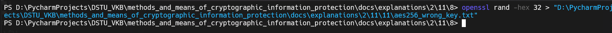
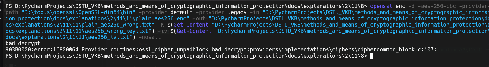
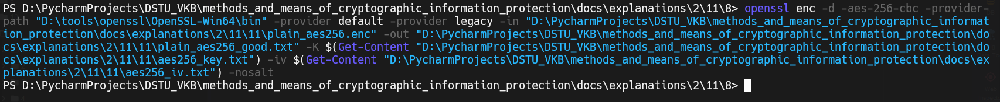
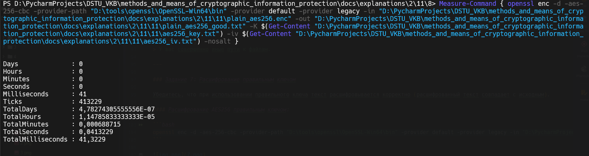
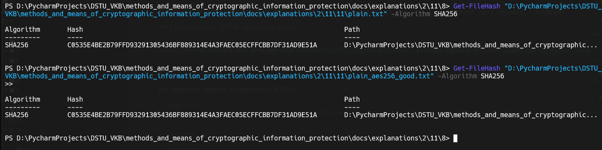

# Задание 11. 

## Условие

Повторите действия 3-7 для алгоритма `AES256`.

## Практическая реализация

### Задание 3: Генерация ключа и IV для AES256

С помощью `OpenSSL` сгенерируйте ключ и вектор инициализации (IV) для алгоритма `AES256`.

#### Генерация ключа и IV для AES256:

```bash
openssl rand -hex 32 > "D:\PycharmProjects\DSTU_VKB\methods_and_means_of_cryptographic_information_protection\docs\explanations\2\11\11\aes256_key.txt"
openssl rand -hex 16 > "D:\PycharmProjects\DSTU_VKB\methods_and_means_of_cryptographic_information_protection\docs\explanations\2\11\11\aes256_iv.txt"
```



> [!NOTE]
> AES256 требует ключ длиной 32 байта (256 бит) и IV длиной 16 байт (128 бит).

> [!IMPORTANT]
> Пути к файлам могут быть абсолютно иными, поменяйте на свой.

---

### Задание 4: Шифрование файла с помощью AES256

С помощью `OpenSSL` примените сгенерированный ключ для шифрования текстового файла алгоритмом `AES256`. Измерьте время шифрования и запомните (запишите) его.

#### Шифрование файла алгоритмом AES256:

```bash
openssl enc -e -aes-256-cbc -provider-path "D:\tools\openssl\OpenSSL-Win64\bin" -provider default -provider legacy -in "D:\PycharmProjects\DSTU_VKB\methods_and_means_of_cryptographic_information_protection\docs\explanations\2\11\11\plain.txt" -out "D:\PycharmProjects\DSTU_VKB\methods_and_means_of_cryptographic_information_protection\docs\explanations\2\11\11\plain_aes256.enc" -K $(Get-Content "D:\PycharmProjects\DSTU_VKB\methods_and_means_of_cryptographic_information_protection\docs\explanations\2\11\11\aes256_key.txt") -iv $(Get-Content "D:\PycharmProjects\DSTU_VKB\methods_and_means_of_cryptographic_information_protection\docs\explanations\2\11\11\aes256_iv.txt") -nosalt
```



Для измерения времени шифрования AES256 в PowerShell:

```powershell
Measure-Command { openssl enc -e -aes-256-cbc -provider-path "D:\tools\openssl\OpenSSL-Win64\bin" -provider default -provider legacy -in "D:\PycharmProjects\DSTU_VKB\methods_and_means_of_cryptographic_information_protection\docs\explanations\2\11\11\plain.txt" -out "D:\PycharmProjects\DSTU_VKB\methods_and_means_of_cryptographic_information_protection\docs\explanations\2\11\11\plain_aes256.enc" -K $(Get-Content "D:\PycharmProjects\DSTU_VKB\methods_and_means_of_cryptographic_information_protection\docs\explanations\2\11\11\aes256_key.txt") -iv $(Get-Content "D:\PycharmProjects\DSTU_VKB\methods_and_means_of_cryptographic_information_protection\docs\explanations\2\11\11\aes256_iv.txt") -nosalt }
```



> [!IMPORTANT]
> У вас совершенно иные пути входных и выходных файлов.

---

### Задание 5: Проверка зашифрованного файла

Откройте зашифрованный файл, убедитесь, что содержимое не является семантически понятным.

#### Проверка файла, зашифрованного AES256:

Файл `plain_aes256.enc` должен содержать бинарные данные, не читаемые в текстовом виде.


---

### Задание 6: Проверка с неправильным ключом

Убедитесь, что при использовании неправильного ключа текст не расшифровывается.

#### Попытка расшифрования AES256 с неправильным ключом:

Создайте неправильный ключ:

```bash
openssl rand -hex 32 > "D:\PycharmProjects\DSTU_VKB\methods_and_means_of_cryptographic_information_protection\docs\explanations\2\11\11\aes256_wrong_key.txt"
```



Попытка расшифрования:

```bash
openssl enc -d -aes-256-cbc -provider-path "D:\tools\openssl\OpenSSL-Win64\bin" -provider default -provider legacy -in "D:\PycharmProjects\DSTU_VKB\methods_and_means_of_cryptographic_information_protection\docs\explanations\2\11\11\plain_aes256.enc" -out "D:\PycharmProjects\DSTU_VKB\methods_and_means_of_cryptographic_information_protection\docs\explanations\2\11\11\plain_aes256_wrong.txt" -K $(Get-Content "D:\PycharmProjects\DSTU_VKB\methods_and_means_of_cryptographic_information_protection\docs\explanations\2\11\11\aes256_wrong_key.txt") -iv $(Get-Content "D:\PycharmProjects\DSTU_VKB\methods_and_means_of_cryptographic_information_protection\docs\explanations\2\11\11\aes256_iv.txt") -nosalt
```



> [!NOTE]
> Эта команда должна выдать ошибку или расшифрованный файл будет содержать мусор / пустой файл.

> [!IMPORTANT]
> У вас совершенно иные пути к файлам.

---

### Задание 7: Расшифрование правильным ключом

Убедитесь, что при использовании правильного ключа текст расшифровывается корректно (расшифрованный текст совпадает с исходным).

#### Расшифрование AES256 правильным ключом:

```bash
openssl enc -d -aes-256-cbc -provider-path "D:\tools\openssl\OpenSSL-Win64\bin" -provider default -provider legacy -in "D:\PycharmProjects\DSTU_VKB\methods_and_means_of_cryptographic_information_protection\docs\explanations\2\11\11\plain_aes256.enc" -out "D:\PycharmProjects\DSTU_VKB\methods_and_means_of_cryptographic_information_protection\docs\explanations\2\11\11\plain_aes256_good.txt" -K $(Get-Content "D:\PycharmProjects\DSTU_VKB\methods_and_means_of_cryptographic_information_protection\docs\explanations\2\11\11\aes256_key.txt") -iv $(Get-Content "D:\PycharmProjects\DSTU_VKB\methods_and_means_of_cryptographic_information_protection\docs\explanations\2\11\11\aes256_iv.txt") -nosalt
```



Для измерения времени расшифрования AES256:

```powershell
Measure-Command { openssl enc -d -aes-256-cbc -provider-path "D:\tools\openssl\OpenSSL-Win64\bin" -provider default -provider legacy -in "D:\PycharmProjects\DSTU_VKB\methods_and_means_of_cryptographic_information_protection\docs\explanations\2\11\11\plain_aes256.enc" -out "D:\PycharmProjects\DSTU_VKB\methods_and_means_of_cryptographic_information_protection\docs\explanations\2\11\11\plain_aes256_good.txt" -K $(Get-Content "D:\PycharmProjects\DSTU_VKB\methods_and_means_of_cryptographic_information_protection\docs\explanations\2\11\11\aes256_key.txt") -iv $(Get-Content "D:\PycharmProjects\DSTU_VKB\methods_and_means_of_cryptographic_information_protection\docs\explanations\2\11\11\aes256_iv.txt") -nosalt }
```



> [!IMPORTANT]
> У вас совершенно иные пути могут быть.

#### Проверка совпадения исходного и расшифрованного файлов:

В PowerShell:

```powershell
Get-FileHash "D:\PycharmProjects\DSTU_VKB\methods_and_means_of_cryptographic_information_protection\docs\explanations\2\11\11\plain.txt" -Algorithm SHA256
Get-FileHash "D:\PycharmProjects\DSTU_VKB\methods_and_means_of_cryptographic_information_protection\docs\explanations\2\11\11\plain_aes256_good.txt" -Algorithm SHA256
```



Если файлы идентичны, хеши будут совпадать.
