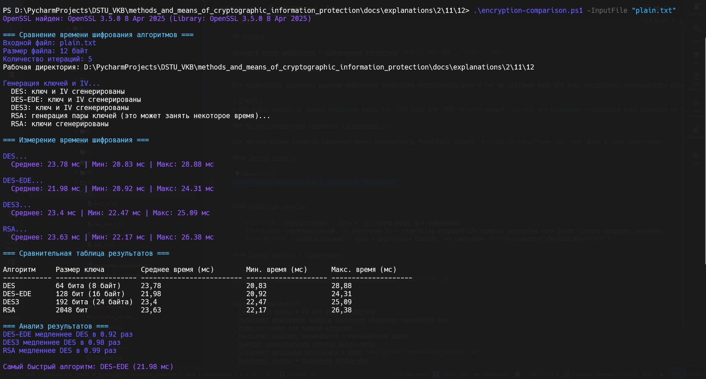

# Задание 12. 

## Условие

Сравните время шифрования с применением алгоритмов `DES`, `DES-EDE`, `DES3`, `RSA`.

## Практическая реализация

Для корректного сравнения времени шифрования необходимо использовать один и тот же тестовый файл для всех алгоритмов. Рекомендуется использовать файл небольшого размера (например, `plain.txt`), чтобы все алгоритмы могли его обработать.

> [!NOTE]
> RSA может шифровать только небольшие файлы (до ~245 байт для 2048-битного ключа), поэтому для сравнения используйте файл размером не более 200 байт.

### Автоматизированное сравнение (рекомендуется)

Для автоматизации процесса сравнения можно использовать PowerShell скрипт `encryption-comparison.ps1` (см. файл в этой директории).

#### Запуск скрипта:

```powershell
.\encryption-comparison.ps1 -InputFile "plain.txt"
```

#### Параметры скрипта:

- `-InputFile` (обязательный) - путь к тестовому файлу для шифрования
- `-Iterations` (необязательный, по умолчанию 5) - количество итераций для каждого алгоритма (для более точного среднего значения)
- `-ProviderPath` (необязательный) - путь к директории OpenSSL (по умолчанию "D:\tools\openssl\OpenSSL-Win64\bin")

#### Пример запуска с параметрами:

```powershell
.\encryption-comparison.ps1 -InputFile "plain.txt" -Iterations 10
```

Скрипт автоматически:
- Генерирует ключи и IV для всех алгоритмов
- Выполняет шифрование каждого алгоритма указанное количество раз
- Измеряет время для каждой итерации
- Вычисляет среднее, минимальное и максимальное время
- Выводит сравнительную таблицу результатов
- Сохраняет детальные результаты в файл `encryption_comparison_results.txt`
- Выполняет анализ и сравнение алгоритмов

