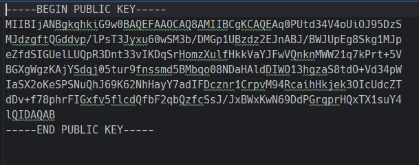

# Задание 4. 

## Условие

С помощью `OpenSSL` примените сгенерированный ключ шифрования и алгоритм `DES` к текстовому файлу. 
Измерьте время шифрования и запомните (запишите) его.

## Реализация

В начале создадим открытый ключ на основе закрытого ключа, для этого воспользуемся командой, которая представлена ниже:

```bash
openssl rsa -in "D:\PycharmProjects\DSTU_VKB\methods_and_means_of_cryptographic_information_protection\docs\explanations\2\11\3\privateRSA.pem" -out "D:\PycharmProjects\DSTU_VKB\methods_and_means_of_cryptographic_information_protection\docs\explanations\2\11\4\publicRSA.pem" -pubout
```

> [!IMPORTANT]
> У вас совершенно иные пути входных и выходных файлов. 



Теперь зашифруем файл с помощью алгоритма `DES`, для этого воспользуемся командой, которая представлена ниже: 

```bash
openssl enc -e -des-cbc -provider-path "D:\tools\openssl\OpenSSL-Win64\bin" -provider default -provider legacy -in "D:\PycharmProjects\DSTU_VKB\methods_and_means_of_cryptographic_information_protection\docs\explanations\2\11\2\warandpeace.txt" -out "D:\PycharmProjects\DSTU_VKB\methods_and_means_of_cryptographic_information_protection\docs\explanations\2\11\4\warandpeace.enc" -pass pass:D:\PycharmProjects\DSTU_VKB\methods_and_means_of_cryptographic_information_protection\docs\explanations\2\11\4\publicRSA.pem -nosalt -md sha1
```

> [!IMPORTANT]
> Пути до файлов у вас абсолютно иные

