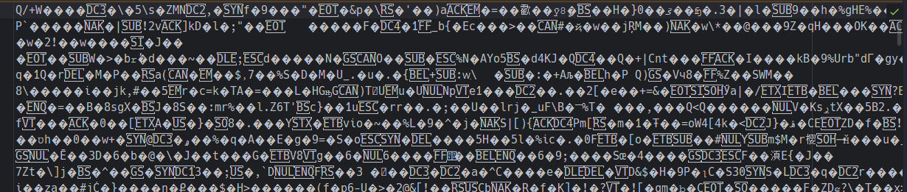

# Задание 5. 

## Условие

Откройте текстовый файл, убедитесь, что содержимое не является семантически понятным.

## Практическая часть

В моем случае получилось то, что представлено на фото ниже: 

