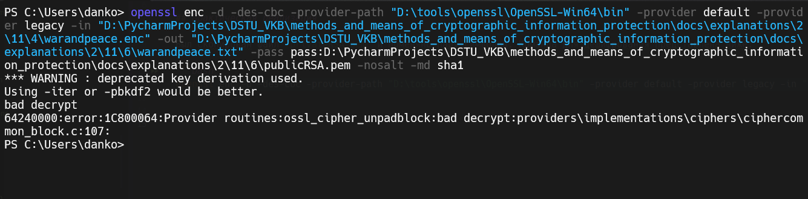

# Задание 6. 

## Условие

Убедитесь, что при передаче неправильного ключа текст не расшифровывается.

## Практическая реализация

Был скопирован файл `publicRSA.pem` и поменяно пару символов. Команда для дешифрования представлена ниже:

```bash
openssl enc -d -des-cbc -provider-path "D:\tools\openssl\OpenSSL-Win64\bin" -provider default -provider legacy -in "D:\PycharmProjects\DSTU_VKB\methods_and_means_of_cryptographic_information_protection\docs\explanations\2\11\4\warandpeace.enc" -out "D:\PycharmProjects\DSTU_VKB\methods_and_means_of_cryptographic_information_protection\docs\explanations\2\11\6\warandpeace.txt" -pass pass:D:\PycharmProjects\DSTU_VKB\methods_and_means_of_cryptographic_information_protection\docs\explanations\2\11\6\publicRSA.pem -nosalt -md sha1
```

> [!IMPORTANT]
> У вас совершенно иные пути к файлам

Если использовать неверный ключ, то выдает ошибку, как представлено на фото ниже:



