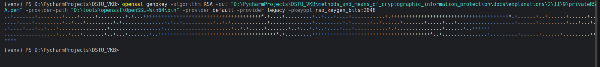
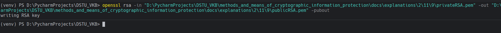
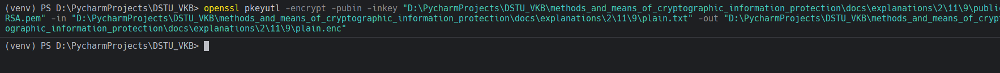
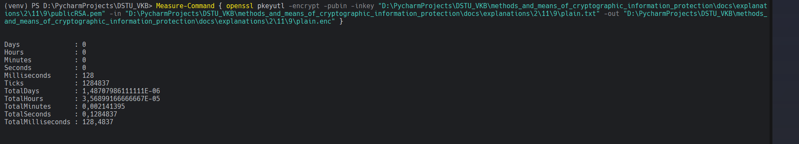
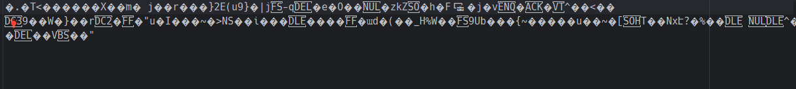
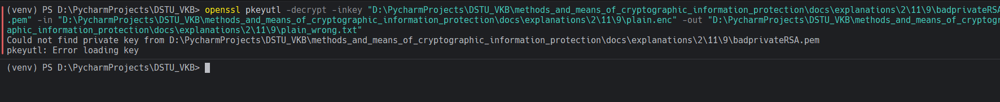
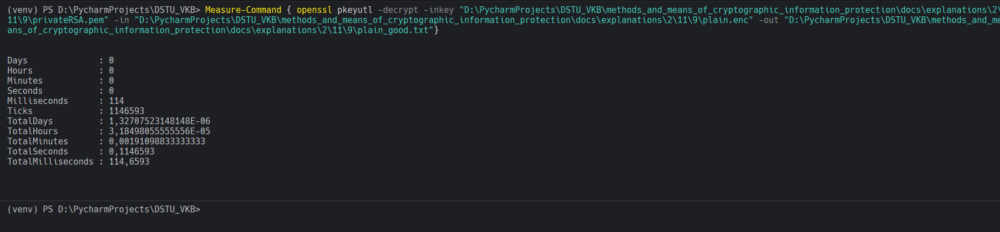

# Задание 9. 

## Условие

Повторите действия 3-7 для алгоритма RSA

## Практическая реализация

### Задание 3 (для RSA): Генерация ключей RSA

С помощью `OpenSSL` сгенерируйте пару ключей (приватный и публичный) для алгоритма `RSA`.

Для генерации приватного ключа RSA воспользуемся командой:

```bash
openssl genpkey -algorithm RSA -out "D:\PycharmProjects\DSTU_VKB\methods_and_means_of_cryptographic_information_protection\docs\explanations\2\11\9\privateRSA.pem" -provider-path "D:\tools\openssl\OpenSSL-Win64\bin" -provider default -provider legacy -pkeyopt rsa_keygen_bits:2048
```

> [!IMPORTANT]
> Пути к файлам могут быть абсолютно иными, поменяйте на свой.



Для генерации публичного ключа на основе приватного:

```bash
openssl rsa -in "D:\PycharmProjects\DSTU_VKB\methods_and_means_of_cryptographic_information_protection\docs\explanations\2\11\9\privateRSA.pem" -out "D:\PycharmProjects\DSTU_VKB\methods_and_means_of_cryptographic_information_protection\docs\explanations\2\11\9\publicRSA.pem" -pubout
```



> [!NOTE]
> Размер ключа (2048 бит) можно изменить на 1024, 3072, 4096 и т.д. в зависимости от требований.

---

### Задание 4 (для RSA): Шифрование файла с помощью RSA

С помощью `OpenSSL` примените сгенерированный публичный ключ RSA для шифрования текстового файла. Измерьте время шифрования и запомните (запишите) его.

> [!WARNING]
> RSA может шифровать только данные размером меньше размера ключа (с учетом padding). Для файла размером больше ~245 байт (для 2048-битного ключа) нужно использовать гибридное шифрование или разбить файл на блоки.

#### Вариант 1: Шифрование небольшого файла (до ~245 байт для 2048-битного ключа)

Для шифрования файла публичным ключом RSA:

```bash
openssl pkeyutl -encrypt -pubin -inkey "D:\PycharmProjects\DSTU_VKB\methods_and_means_of_cryptographic_information_protection\docs\explanations\2\11\9\publicRSA.pem" -in "D:\PycharmProjects\DSTU_VKB\methods_and_means_of_cryptographic_information_protection\docs\explanations\2\11\9\plain.txt" -out "D:\PycharmProjects\DSTU_VKB\methods_and_means_of_cryptographic_information_protection\docs\explanations\2\11\9\plain.enc"
```



Для измерения времени шифрования в PowerShell:

```powershell
Measure-Command { openssl pkeyutl -encrypt -pubin -inkey "D:\PycharmProjects\DSTU_VKB\methods_and_means_of_cryptographic_information_protection\docs\explanations\2\11\9\publicRSA.pem" -in "D:\PycharmProjects\DSTU_VKB\methods_and_means_of_cryptographic_information_protection\docs\explanations\2\11\9\plain.txt" -out "D:\PycharmProjects\DSTU_VKB\methods_and_means_of_cryptographic_information_protection\docs\explanations\2\11\9\plain.enc" }
```




### Задание 5 (для RSA): Проверка зашифрованного файла

Откройте зашифрованный файл, убедитесь, что содержимое не является семантически понятным.



### Задание 6 (для RSA): Проверка с неправильным ключом

Убедитесь, что при использовании неправильного ключа (например, публичного ключа для расшифрования) текст не расшифровывается.

Попытка расшифрования публичным ключом (неправильный ключ):

```bash
openssl pkeyutl -decrypt -inkey "D:\PycharmProjects\DSTU_VKB\methods_and_means_of_cryptographic_information_protection\docs\explanations\2\11\9\badprivateRSA.pem" -in "D:\PycharmProjects\DSTU_VKB\methods_and_means_of_cryptographic_information_protection\docs\explanations\2\11\9\plain.enc" -out "D:\PycharmProjects\DSTU_VKB\methods_and_means_of_cryptographic_information_protection\docs\explanations\2\11\9\plain_wrong.txt"
```

> [!NOTE]
> Эта команда должна выдать ошибку.



### Задание 7 (для RSA): Расшифрование правильным ключом

Убедитесь, что при использовании правильного приватного ключа текст расшифровывается корректно (расшифрованный текст совпадает с исходным).

Расшифрование приватным ключом (правильный ключ):

```bash
openssl pkeyutl -decrypt -inkey "D:\PycharmProjects\DSTU_VKB\methods_and_means_of_cryptographic_information_protection\docs\explanations\2\11\9\privateRSA.pem" -in "D:\PycharmProjects\DSTU_VKB\methods_and_means_of_cryptographic_information_protection\docs\explanations\2\11\9\plain.enc" -out "D:\PycharmProjects\DSTU_VKB\methods_and_means_of_cryptographic_information_protection\docs\explanations\2\11\9\plain_good.txt"
```

Для измерения времени расшифрования:

```powershell
Measure-Command { openssl pkeyutl -decrypt -inkey "D:\PycharmProjects\DSTU_VKB\methods_and_means_of_cryptographic_information_protection\docs\explanations\2\11\9\privateRSA.pem" -in "D:\PycharmProjects\DSTU_VKB\methods_and_means_of_cryptographic_information_protection\docs\explanations\2\11\9\plain.enc" -out "D:\PycharmProjects\DSTU_VKB\methods_and_means_of_cryptographic_information_protection\docs\explanations\2\11\9\plain_good.txt"}
```



> [!IMPORTANT]
> У вас совершенно иные пути могут быть

#### Проверка совпадения исходного и расшифрованного файлов:

В PowerShell:

```powershell
Get-FileHash "D:\PycharmProjects\DSTU_VKB\methods_and_means_of_cryptographic_information_protection\docs\explanations\2\11\9\plain.txt" -Algorithm SHA256
Get-FileHash "D:\PycharmProjects\DSTU_VKB\methods_and_means_of_cryptographic_information_protection\docs\explanations\2\11\9\plain_good.txt" -Algorithm SHA256
```
