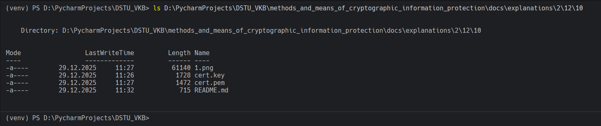

# Задание 13. 

## Условие

Проверим наличие в папке `lab` созданного сертификата `cert.pem`, и закрытого ключа `cert.key`.

## Практическая реализация

Создавал ещё в 10 задании. Проверить в моем случае можно с помощью команды, которая представлена ниже: 

```bash
ls D:\PycharmProjects\DSTU_VKB\methods_and_means_of_cryptographic_information_protection\docs\explanations\2\12\10
```



> [!IMPORTANT]
> У вас совершенно иные пути

