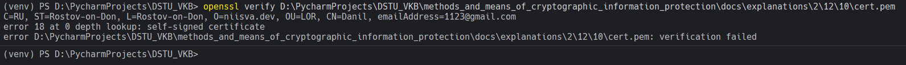

# Задание 13. 

## Условие

Выполним проверку сертификата

## Практическая реализация

Для выполнения проверки нужно воспользоваться командой, которая представлена ниже: 

```bash
openssl verify D:\PycharmProjects\DSTU_VKB\methods_and_means_of_cryptographic_information_protection\docs\explanations\2\12\10\cert.pem
```

