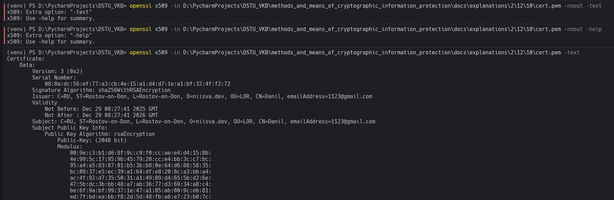

# Задание 14. 

## Условие

Вывести подробную информацию о сертификате

## Практическая реализация

Для выполнения задания воспользуемся командой, которая представлена ниже: 

```bash
openssl x509 -in D:\PycharmProjects\DSTU_VKB\methods_and_means_of_cryptographic_information_protection\docs\explanations\2\12\10\cert.pem –text
```



