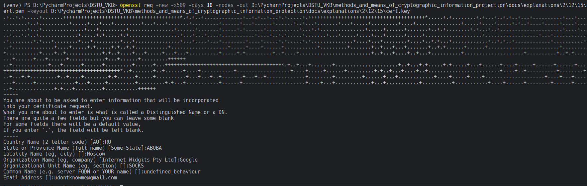

# Задание 15. 

## Условие

Создать новый сертификат 

## Практическая реализация

Для выполнения данного задания воспользуемся командой, которая представлена ниже: 

```bash
openssl req -new -x509 -days 10 -nodes -out D:\PycharmProjects\DSTU_VKB\methods_and_means_of_cryptographic_information_protection\docs\explanations\2\12\15\cert.pem -keyout D:\PycharmProjects\DSTU_VKB\methods_and_means_of_cryptographic_information_protection\docs\explanations\2\12\15\cert.key
```

