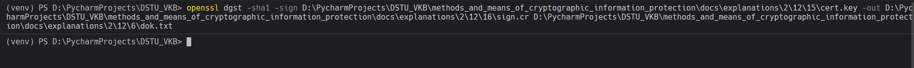

# Задание 16. 

## Условие

Создание электронной подписи файла. Сначала создаем секретный ключ. 

## Практическая реализация

Для выполнения задания воспользуемся командой, которая представлена ниже: 

```bash
openssl dgst -sha1 -sign D:\PycharmProjects\DSTU_VKB\methods_and_means_of_cryptographic_information_protection\docs\explanations\2\12\15\cert.key -out D:\PycharmProjects\DSTU_VKB\methods_and_means_of_cryptographic_information_protection\docs\explanations\2\12\16\sign.cr D:\PycharmProjects\DSTU_VKB\methods_and_means_of_cryptographic_information_protection\docs\explanations\2\12\6\dok.txt
```



> [!IMPORTANT]
> У вас могут быть совершенно иные пути для выполнения данного задания

