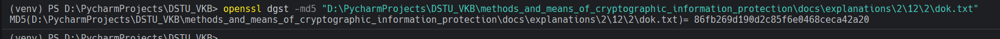

# Задание 3. 

## Условие

С помощью `OpenSSL` вычислите значение хэш-функции `MD5` от подготовленного текста. 
Измерьте время хеширования и запомните (запишите) его.

## Практическая реализация

Для реализации данного задания воспользуемся командой, которая представлена ниже:

```bash
openssl dgst -md5 "D:\PycharmProjects\DSTU_VKB\methods_and_means_of_cryptographic_information_protection\docs\explanations\2\12\2\dok.txt"
```



Для измерения времени хэширования можно использовать команду, которая представлена ниже: 

```powershell
Measure-Command { openssl dgst -md5 "D:\PycharmProjects\DSTU_VKB\methods_and_means_of_cryptographic_information_protection\docs\explanations\2\12\2\dok.txt" }
```


> [!IMPORTANT]
> У вас будут совершенно иные пути до файлов. 
