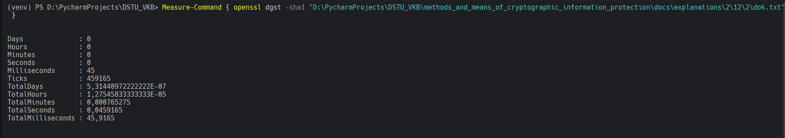
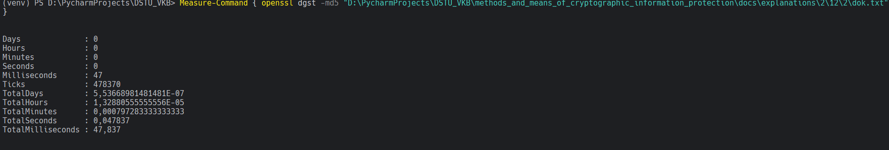

# Задание 5. 

## Условие

Сравните время хэширования с применением двух алгоритмов. 

## Практическая реализация

В случае `sha-1` вышло то, что представлено на рисунке ниже: 

В случае `md5` вышло то, что представлено на рисунке ниже: 

  