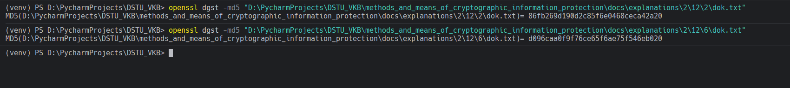

# Задание 7. 

## Условие

Посчитайте хеш-суммы `MD5` и `SHA1` от измененного файла. Убедитесь, что значения сумм от исходного и измененного файлов не совпадают.

## Практическая реализация

Для оригинального файл посчитаем `MD5` хэш, для этого используем команду:

```bash
openssl dgst -md5 "D:\PycharmProjects\DSTU_VKB\methods_and_means_of_cryptographic_information_protection\docs\explanations\2\12\2\dok.txt"
```

Для измененного файла посчитаем `MD5` хэш, для этого используем команду: 

```bash
openssl dgst -md5 "D:\PycharmProjects\DSTU_VKB\methods_and_means_of_cryptographic_information_protection\docs\explanations\2\12\6\dok.txt"
```



Для оригинального файл посчитаем `SHA1` хэш, для этого используем команду:

```bash
openssl dgst -sha1 "D:\PycharmProjects\DSTU_VKB\methods_and_means_of_cryptographic_information_protection\docs\explanations\2\12\2\dok.txt"
```

Для измененного файла посчитаем `SHA1` хэш, для этого используем команду: 

```bash
openssl dgst -sha1 "D:\PycharmProjects\DSTU_VKB\methods_and_means_of_cryptographic_information_protection\docs\explanations\2\12\6\dok.txt"
```


