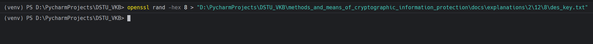
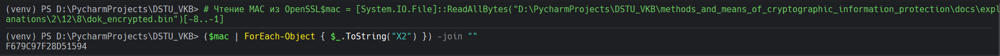

# Задание 8. 

## Условие

Получите аутентификатор выбранного файла с применением алгоритма `DES-CBC` с помощью `OpenSSL` и вручную.

## Практическая реализация

Аутентификатор (MAC - Message Authentication Code) для DES-CBC получается путем шифрования файла в режиме CBC и взятия последнего блока зашифрованных данных как MAC.

### Подготовка

1. Убедитесь, что у вас есть тестовый файл (например, `dok.txt` из задания 2)
2. Сгенерируйте ключ для DES-CBC

### Генерация ключа

```bash
openssl rand -hex 8 > "D:\PycharmProjects\DSTU_VKB\methods_and_means_of_cryptographic_information_protection\docs\explanations\2\12\8\des_key.txt"
```



> [!NOTE]
> DES использует ключ длиной 8 байт (64 бита, из которых 56 бит эффективных).

---

### Получение MAC с помощью OpenSSL

#### Использование `openssl enc` и извлечение последнего блока

Зашифруйте файл с нулевым IV и извлеките последние 8 байт:

```bash
# Шифрование файла с нулевым IV
openssl enc -e -des-cbc -provider-path "D:\tools\openssl\OpenSSL-Win64\bin" -provider default -provider legacy -in "D:\PycharmProjects\DSTU_VKB\methods_and_means_of_cryptographic_information_protection\docs\explanations\2\12\2\dok.txt" -out "D:\PycharmProjects\DSTU_VKB\methods_and_means_of_cryptographic_information_protection\docs\explanations\2\12\8\dok_encrypted.bin" -K $(Get-Content "D:\PycharmProjects\DSTU_VKB\methods_and_means_of_cryptographic_information_protection\docs\explanations\2\12\8\des_key.txt") -iv 0000000000000000 -nosalt
```

Через командную строку с использованием `tail` (если доступен) или PowerShell:

```powershell
$mac = [System.IO.File]::ReadAllBytes("D:\PycharmProjects\DSTU_VKB\methods_and_means_of_cryptographic_information_protection\docs\explanations\2\12\8\dok_encrypted.bin")[-8..-1]
($mac | ForEach-Object { $_.ToString("X2") }) -join ""
```



### Получение MAC вручную (пошаговый алгоритм)

CBC-MAC для DES работает следующим образом:

1. **Разбиение файла на блоки по 8 байт (64 бита)**
   - Если размер файла не кратен 8 байтам, последний блок дополняется (padding) согласно PKCS#7

2. **Инициализация**
   - Первый блок: `C₁ = DES_encrypt(P₁, K)` где IV = 0 (нулевой вектор инициализации)
   - P₁ - первый блок открытого текста
   - K - ключ шифрования

3. **Обработка последующих блоков**
   - Для каждого следующего блока: `Cᵢ = DES_encrypt(Pᵢ ⊕ Cᵢ₋₁, K)`
   - Где ⊕ - операция XOR

4. **Результат**
   - MAC = последний зашифрованный блок Cₙ (8 байт)

---

---

### Важные замечания

1. **IV должен быть нулевым**: Для CBC-MAC используется нулевой вектор инициализации (все нули)

2. **Padding**: Если размер файла не кратен 8 байтам, необходимо дополнить последний блок согласно PKCS#7

3. **Размер MAC**: MAC для DES-CBC всегда составляет 8 байт (64 бита)

4. **Безопасность**: DES-CBC MAC устарел и не рекомендуется для новых приложений. Используйте HMAC или CMAC для современных приложений

> [!IMPORTANT]
> Пути к файлам могут быть абсолютно иными, поменяйте на свой.

> [!WARNING]
> DES считается устаревшим алгоритмом из-за малой длины ключа (56 бит). Для практического применения рекомендуется использовать AES-CMAC или HMAC-SHA256.
