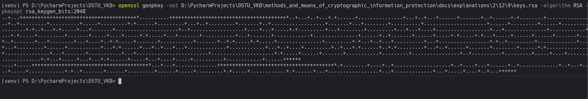
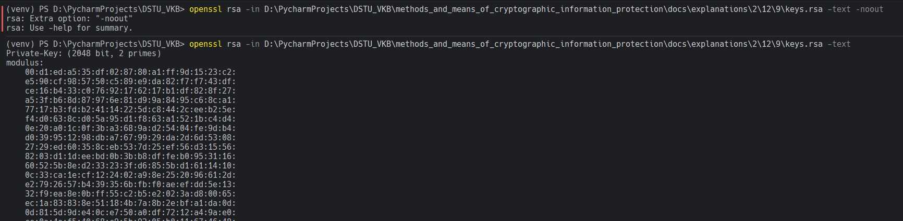
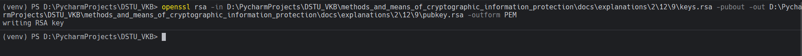
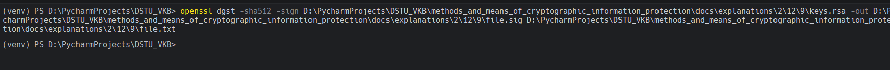
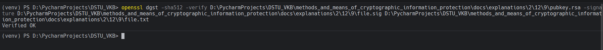
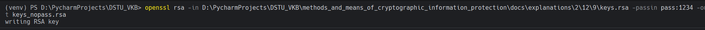

# Задание 9. 

## Условие

Выполните операции с хэш-функцией, используя закрытый и открытый ключ. Сгенерировать закрытый ключ длиной 2048 бит без
парольной фразы для алгоритма `RSA` и записать их в файл `keys.rsa`. Вывести информацию о закрытом ключе. 
Извлечь открытый ключ в формате РЕМ из закрытого ключа. Подписать хэш-сумму `sha512` от файла `file` закрытым ключом алгоритма
`RSA`, записать подпись в файл `file.sig`. Проверить подпись хэш-суммы `sha512` из файла `file.sig` для файла `file` по
алгоритму `RSA`. Снять защиту ключа парольной фразой.

## Практическая реализация

В начале сгенерируем закрытый ключ длиной 2048 бит без парольной фразы для алгоритма `RSA` и записать их в файл `keys.rsa`.
Для этого будем пользоваться командой, которая представлена ниже: 

```bash
openssl genpkey -out D:\PycharmProjects\DSTU_VKB\methods_and_means_of_cryptographic_information_protection\docs\explanations\2\12\9\keys.rsa -algorithm RSA -pkeyopt rsa_keygen_bits:2048
```



> [!IMPORTANT]
> У вас совершенно иные пути

Теперь выведем информацию о закрытом ключе, для этого будем использовать команду, которая представлена ниже: 

```bash
openssl rsa -in D:\PycharmProjects\DSTU_VKB\methods_and_means_of_cryptographic_information_protection\docs\explanations\2\12\9\keys.rsa -text –noout
```



Теперь перейдем к извлечению открытого ключа в формате `PEM` из закрытого ключа, для этого воспользуемся командой, 
которая представлена ниже: 

```bash
openssl rsa -in D:\PycharmProjects\DSTU_VKB\methods_and_means_of_cryptographic_information_protection\docs\explanations\2\12\9\keys.rsa -pubout -out D:\PycharmProjects\DSTU_VKB\methods_and_means_of_cryptographic_information_protection\docs\explanations\2\12\9\pubkey.rsa -outform PEM
```



Теперь подпишем хэш-сумму `sha-512` от файла `file` закрытым ключом алгоритма `RSA`, для этого воспользуемся командой: 

```bash
openssl dgst -sha512 -sign D:\PycharmProjects\DSTU_VKB\methods_and_means_of_cryptographic_information_protection\docs\explanations\2\12\9\keys.rsa -out D:\PycharmProjects\DSTU_VKB\methods_and_means_of_cryptographic_information_protection\docs\explanations\2\12\9\file.sig D:\PycharmProjects\DSTU_VKB\methods_and_means_of_cryptographic_information_protection\docs\explanations\2\12\9\file.txt
```



Теперь проверим подпись хэш-суммы `sha-512` из файла `file.sig` для файла `file` по алгоритму `RSA`:

```bash
openssl dgst -sha512 -verify D:\PycharmProjects\DSTU_VKB\methods_and_means_of_cryptographic_information_protection\docs\explanations\2\12\9\pubkey.rsa -signature D:\PycharmProjects\DSTU_VKB\methods_and_means_of_cryptographic_information_protection\docs\explanations\2\12\9\file.sig D:\PycharmProjects\DSTU_VKB\methods_and_means_of_cryptographic_information_protection\docs\explanations\2\12\9\file.txt
```



Теперь снимем защиту ключа парольной фразой, в результате получится то, что представлено ниже: 

```bash
openssl rsa -in D:\PycharmProjects\DSTU_VKB\methods_and_means_of_cryptographic_information_protection\docs\explanations\2\12\9\keys.rsa -passin pass:1234 -out D:\PycharmProjects\DSTU_VKB\methods_and_means_of_cryptographic_information_protection\docs\explanations\2\12\9\keys_nopass.rsa
```



