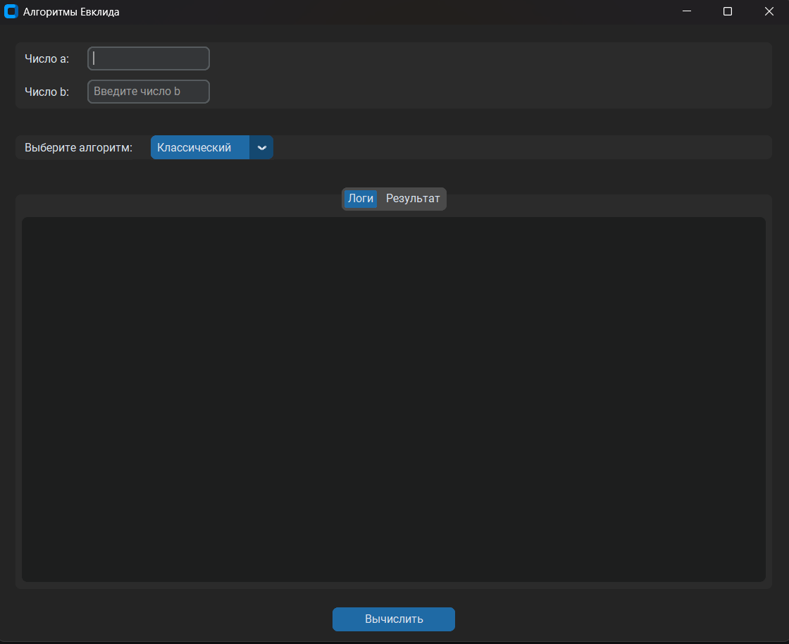
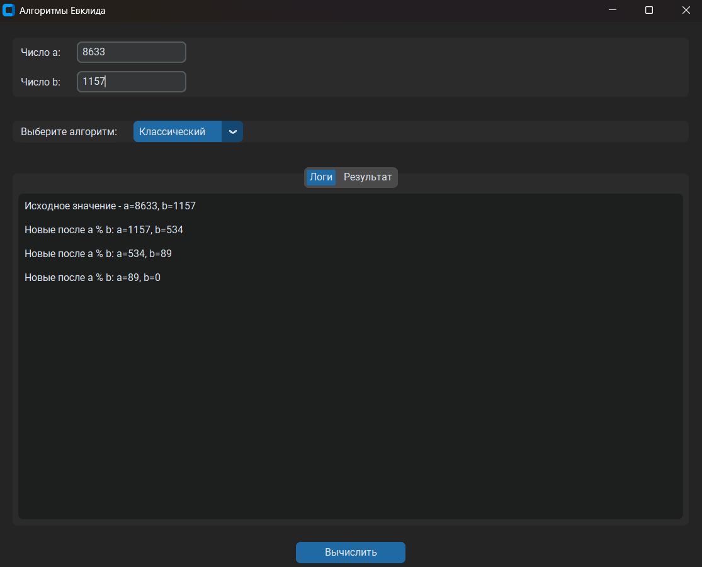

# 1 лабораторная работа **«Алгоритм Евклида»**

### Задание. 

Вычислить НОД(a, b) при помощи: 
- алгоритма Евклида с делением с остатком;
- бинарного алгоритма Евклида; 
- расширенного алгоритма Евклида.

Сравнить количество итераций. Написать программу, реализующую расширенный алгоритм Евклида.

- Вариант 1. `a` = 451, `b` = 3977.
- Вариант 2. `a` = 3102, `b` = 4277.
- Вариант 3. `a` = 901, `b` = 4717.
- Вариант 4. `a` = 1463, `b` = 6391.
- Вариант 5. `a` = 3289, `b` = 11297.
- Вариант 6. `a` = 1711, `b` = 4189.
- Вариант 7. `a` = 1891, `b` = 4087.
- Вариант 8. `a` = 1739, `b` = 2867.
- Вариант 9. `a` = 2911, `b` = 4189.
- Вариант 10. `a` = 3713, `b` = 4187.
- Вариант 11. `a` = 4399, `b` = 3403.
- Вариант 12. `a` = 5251, `b` = 4183.
- Вариант 13. `a` = 5551, `b` = 3367.
- Вариант 14. `a` = 6499, `b` = 5335.
- Вариант 15. `a` = 7171, `b` = 3131.
- Вариант 16. `a` = 9559, `b` = 3509.
- Вариант 17. `a` = 4067, `b` = 1127.
- Вариант 18. `a` = 8099, `b` = 2275.
- Вариант 19. `a` = 7553, `b` = 1411.
- Вариант 20. `a` = 8633, `b` = 1157.
- Вариант 21. `a` = 2291, `b` = 7663.
- Вариант 22. `a` = 2201, `b` = 6461.
- Вариант 23. `a` = 3367, `b` = 8099.
- Вариант 24. `a` = 2120, `b` = 4399.
- Вариант 25. `a` = 2679, `b` = 4503.
- Вариант 26. `a` = 3233, `b` = 1769.
- Вариант 27. `a` = 3953, `b` = 1541.
- Вариант 28. `a` = 4740, `b` = 3871.
- Вариант 29. `a` = 4970, `b` = 1917.
- Вариант 30. `a` = 4970, `b` = 923.

### Установка и запуск

Создайте `.venv`, используя `Pycharm` или кодовой строки. Вся информация есть в Интернете. 

> [!IMPORTANT]
> Перезапустите терминал, чтобы появился `.venv`

Дальше устанавливаем `uv`:

```bash
pip install uv
```

Устанавливаем все зависимости с помощью `uv`:

```bash
uv sync
```

### Архитектура приложения

Здесь используется паттерн `MVP`

### Скриншоты приложения



