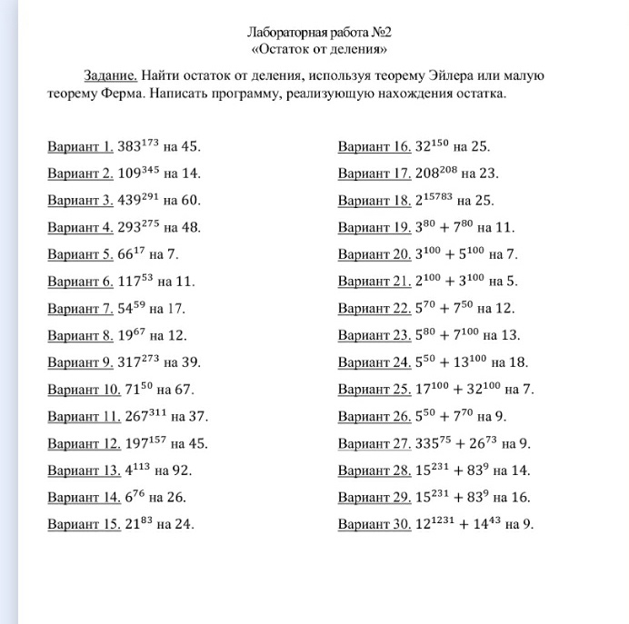

# Лабораторная работа 2 **«Сравнение первой степени»**

### Задание

#### Из `PDF` файла: 

Решить сравнение первой степени при помощи функции Эйлера. Написать программу, реализующую решение сравнения первой степени

- Вариант 1. 15x ≡ 21(mod 18).
- Вариант 2. 12x ≡ 16(mod 28).
- Вариант 3. 18x ≡ 12(mod 30).
- Вариант 4. 7x ≡ 15(mod 25).
- Вариант 5. 75x ≡ 54(mod 21).
- Вариант 6. 37x ≡ 16(mod 11).
- Вариант 7. 39x ≡ 5(mod 11).
- Вариант 8. 20x ≡ 35(mod 45).
- Вариант 9. 183x ≡ 93(mod 111).
- Вариант 10. 19x ≡ 4(mod 25).
- Вариант 11. 11x ≡ 15(mod 24).
- Вариант 12. 39x ≡ 19(mod 53).
- Вариант 13. 45x ≡ 21(mod 132).
- Вариант 14. 12x ≡ 15(mod 35).
- Вариант 15. 21x ≡ 10(mod 25).
- Вариант 16. 15x ≡ 7(mod 16).
- Вариант 17. 8x ≡ 17(mod 23).
- Вариант 18. 64x ≡ 51(mod 13).
- Вариант 19. 15x ≡ 21(mod 6).
- Вариант 20. 57x ≡ 15(mod 48).
- Вариант 21. 64x ≡ 5(mod 13).
- Вариант 22. 139x ≡ 7(mod 8).
- Вариант 23. 14x ≡ 9(mod 37).
- Вариант 24. 32x ≡ 13(mod 15).
- Вариант 25. 42x ≡ 105(mod 245).
- Вариант 26. 29x ≡ 35(mod 123).
- Вариант 27. 21x ≡ 15(mod 111).
- Вариант 28. 15x ≡ 120(mod 85).
- Вариант 29. 8x ≡ 15(mod 29).
- Вариант 30. 8x ≡ 17(mod 31).

#### С фотографии




### Установка и запуск

Создайте `.venv`, используя `Pycharm` или командной строки. Вся информация есть в Интернете. 

> [!IMPORTANT]
> Перезапустите терминал, чтобы появился `.venv`

Дальше устанавливаем `uv`:

```bash
pip install uv
```

Устанавливаем все зависимости с помощью `uv`:

```bash
uv sync
```

### Архитектура приложения

Здесь используется паттерн `MVP`

### Как использовать? 

Ис

> [!IMPORTANT]
> Вводите числа по вертикали, то есть 
