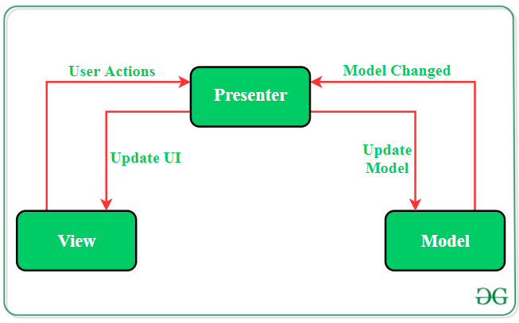
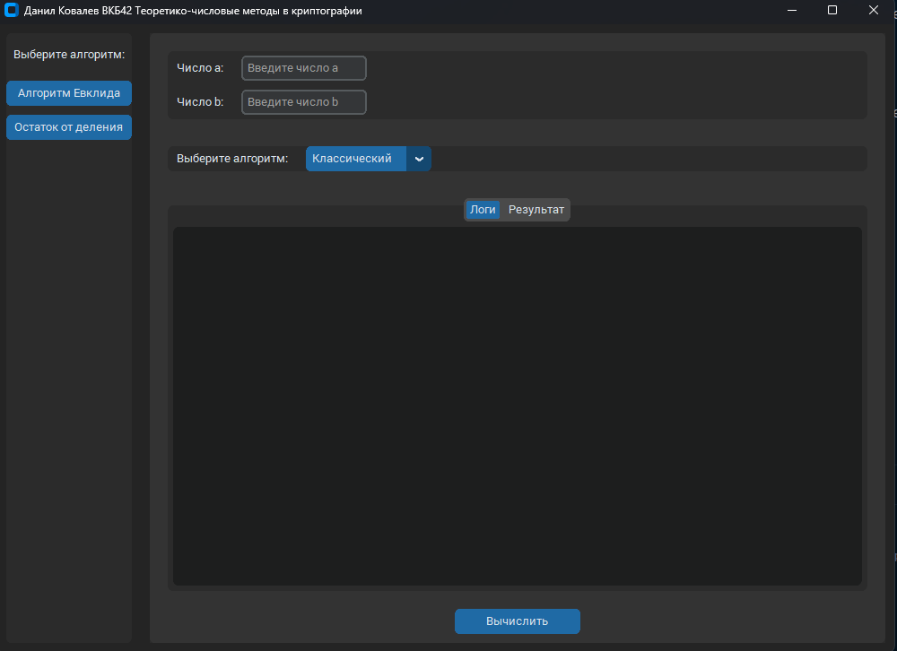

# Теоретико-числовые методы в криптографии

### Как установить и пользоваться?

> [!IMPORTANT]
> Откройте данную директорию у себя в редакторе кода, не полностью проект `DSTU_VKB`,
> а именно `number_theoretic_methods_in_cryptography`.

Создайте `.venv` - виртуальное окружение.

Здесь есть 2 варианта:

- Первый это с помощью `Python`, вот [гайд](https://www.geeksforgeeks.org/create-virtual-environment-using-venv-python/)
- Второй с помощью `Pycharm`, вот [гайд](https://www.jetbrains.com/help/pycharm/creating-virtual-environment.html)

Откройте новую сессию в терминале, после чего выполните команду, которая представлена ниже:

```bash
pip install uv
```

> [!IMPORTANT]
> У вас терминале должна появиться надпись `.venv` или же `venv`.
> В ином случае вы поставите зависимость глобально систему, что не есть хорошо.

Установите все библиотеки, как представлено командой ниже:

```bash
uv sync
```

После того как все удачно установилось, можете пользоваться приложением, точка запуска находится [здесь](app/main.py).

### Где находятся условия лабораторных?

Откройте [данную директорию](docs).
На момент заполнения `README.md` есть такие [условия лабораторных работ](docs/2024-2025/conditions)

### Архитектура приложения

Здесь используется паттерн `MVP` для всего приложения, более подробно представляю его работу здесь:



### Как добавить новую лабораторную, которой здесь нет? 

#### `Model`

Вы должны написать `Model`, как пример вот здесь: 

```python
class GCDBezout(BaseGCDStrategy):
    @override
    def compute(self, a: NumberType, b: NumberType) -> ResultDTO:
        ...
```

> [!NOTE]
> `Model` - это непосредственно логика лабораторной работы

#### `Presenter`

Прокинуть `Model` в `Presenter` через композицию, т.е сделать непосредственное создание `Model` в `Presenter`, как представлено в примере ниже: 

```python
class GCDCalculatorPresenter(IGCDPresenter):
    def __init__(self) -> None:
        self.view: IGCDView | None = None
        self.strategies: dict[str, type[BaseGCDStrategy]] = {
            "Классический": GCDMod,
            "Бинарный": GCDBinary,
            "Расширенный": GCDBezout
        }

    @override
    def attach_view(self, view: IGCDView) -> None:
        self.view = view
        self.view.set_strategies(list(self.strategies.keys()))
```

> [!IMPORTANT]
> Вы должны написать свой интерфейс, который должен наследоваться от интерфейса - [`ITaskPresenter`](app/presenters/tasks/base.py). 
> В ином cлучае, у вас не заработает приложение. Вы обязаны соблюдать контракты, чтобы все было автоматизировано.

#### `View`

И вам остается написать только `View`, который будет отвечать за ваше приложение.
Он тоже должен наследоваться от нужного [интерфейса](app/views/tasks/base.py). 
Пример смотрите вот [здесь](app/views/tasks/euclidian_algorithms/base.py)

#### `main`

Вам [здесь](app/main.py) добавить название алгоритма, класс `Presenter` и класс `View`. Думаю разберетесь по типизации. 

### Скриншоты приложения



### Почему я сделал одно общее приложение?

Каждый год здесь меняются лабораторные, дополняются или тасуются.
И я бы не мог создать директории по типу: `1`, `2` и т.п. 
Вследствие этого пришлось создать общее приложение, которое будет содержать все алгоритмы.

> [!NOTE]
> Простите за страшный визуал приложения, но нейронки лучше выдают, а вручную такое делать я точно не собираюсь)))

Ссылки на все отчеты: https://drive.google.com/drive/folders/1ZVW_qy5lrDHbeu5LNwTUImXkdVvMPheZ