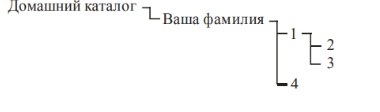

## Создать в домашнем каталоге следующую структуру подкаталогов (существующие каталоги не удалять!):



Поменяйте обязательно фамилию на вашу, чтобы было все, как по заданию. 

Для выполнения заданий я использовал команду, которая представлена ниже: 

```bash
mkdir -p ./Kovalev/1/{2,3} ./Kovalev/4
```