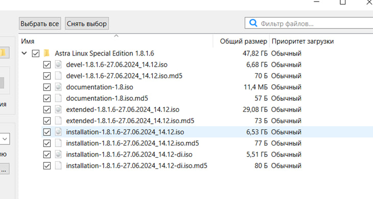
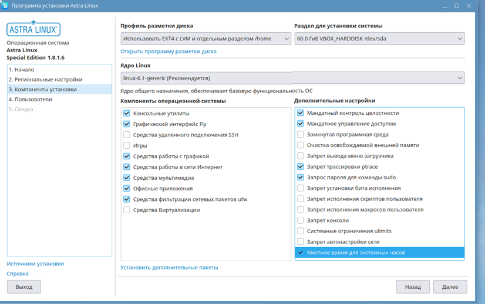
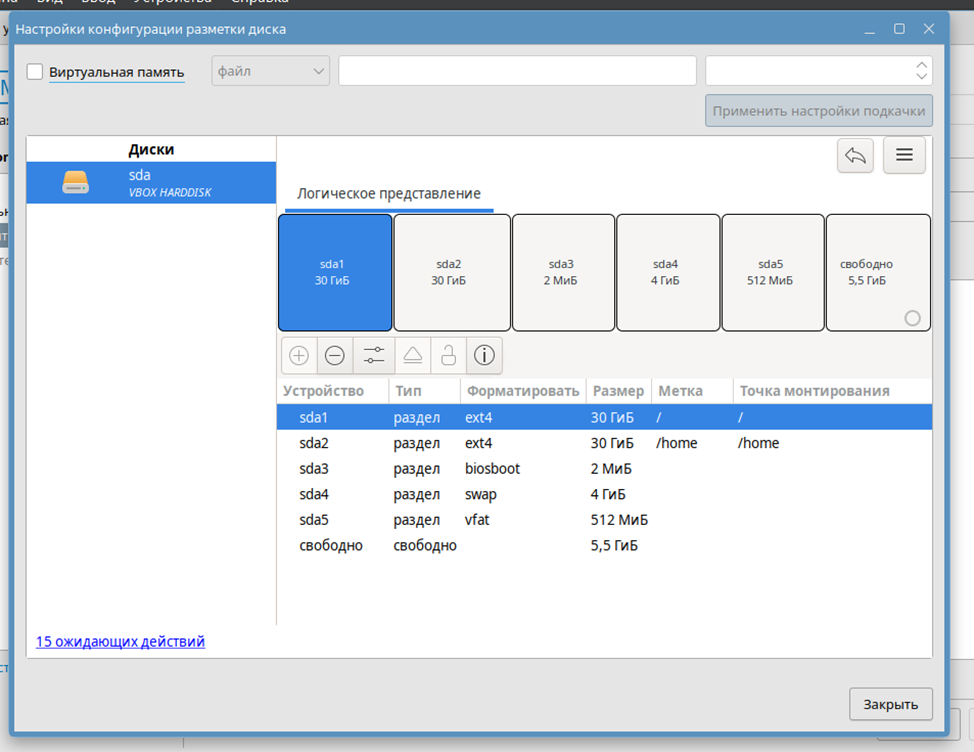

## Выполнить поэтапную установку Astra Linux SE с ручной разметкой накопителя! Уметь рассказать процесс

> [!IMPORTANT]
> На данный момент нет возможности скачать SE версию. Я смог найти её в Интернете. 
> Скачивал с [сайта](https://softwar.ru/linux-unix/3752-astra-linux-special-edition.html).

После того как скачаете торрент файл. Вам нужно будет выбрать определенные файлы. 
Переходим к процессу установки. Те, кто будут устанавливать через образ на диск, процесс схож с установкой `Windows`.
Сейчас распишу небольшой гайд для тех, кто будет устанавливать образ на виртуальную машину.

Выбираем `iso`, который мы хотим установить. При установке я ввёл такие параметры. 
Имя можете написать любое другое. Выделяем оперативную память, ЦП, пространство на диске. Я выделил 4096 Мб, 4 ЦП, 70 Гб. 
Но вы можете больше, но не рекомендую меньше.

Запускаем. При входе в систему, установщик запуститься сам, либо запускаем сами. Он будет на рабочем столе. 
Первая два пункта типичные для установки. Выбрать язык и региональные настройки.
Самое важное – это разметка и дополнительные настройки. Хочу уточнить, что во время установки есть пункт 
“Уровень безопасности”. Можете выбрать любой, но я выбрал последний, чтобы он полный функционал `ASTRA`.

> [!NOTE]
> - Ставим галачку возле параметров с Мандатным контролем и управлением, тем самым выполняем задание 4.
> - Ставим галочку слева от любого другого параметра, но рекомендую поставить левее от “Местное время для системных часов”.
> Этим действием мы выполнили задание 3.
> - Выполним разметку диска. Где “Профиль разметки диска” выбираем ручную разметку.
> Дальше под ручной разметкой выбираем “Открыть программу разметки диска”.

Разметка схожа, как в `Ubuntu`, только нужно по заданию выделить раздел под `EFI`. 

> [!IMPORTANT]
> Учтите! Метка – это название раздела, а точка монтирования – это путь до раздела. Лучше сделать так, чтобы название и точка монтирования совпадала

В итоге мы должны получить такие разделы:
- Раздел `“/”`. Файловая система `ext4`. Точка монтирования `/`
- Раздел `“/home”`. Файловая система `ext4`. Точка монтирования `/Home`
- Раздел `Swap`. Выбираем файловую систему `swap` (Оперативку он вроде выделит сам, если нет вводим сколько выделили под оперативную память)
- Раздел под `EFI`. Файловая система `vfat`. Я выделил 512 Мб, но можно чуть меньше.
- Раздел под `boot`. Файловая система `biosboot`. Он сам выделит память.

### Настройка установки приложений

После установки `Astra Linux` у вас скорее всего не получится скачивать различные приложения. Чтобы решить эту проблему, нужно выполнить пару пунктов. 

1. Переходим в меню "Пуск"
2. В поисковик вбиваем менеджер пакетов `synaptic`. На момент версии 1.8 он выглядит вот так:

3. Вводим пароль, после этого вы увидите окно, которое представлено ниже на фото:

4. Переходим в настройки, выбираем репозитории. Все показано на рисунке ниже:

5. Изначально это репозитории будут выключены. Вам нужно их включить. Далее нажимаем ОК. Вам предложат обновить репозитории. Соглашаемся. Готово
