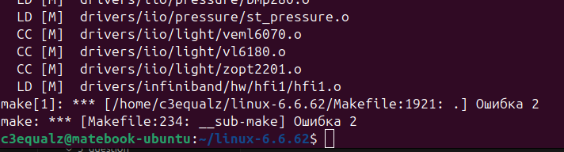

## Скомпилировать и собрать пакет ядра

Компилируйте ядро и соберите пакет:

```bash
sudo make -j$(nproc)
sudo make modules_install
sudo make install
```

Создайте пакет `.deb` с именем, содержащим вашу фамилию на английском языке:

```bash
make-kpkg --initrd --append-to-version=-yourname kernel_image kernel_headers
```

>[IMPORTANT!]
> Замените yourname на вашу фамилию в нижнем регистре. 

---

Если вышеописанные команды не сработали, то у Вас проблемы с параметрами ядра. Их можно сбросить, используя нижеописанную команду 

```bash
make defconfig
```

