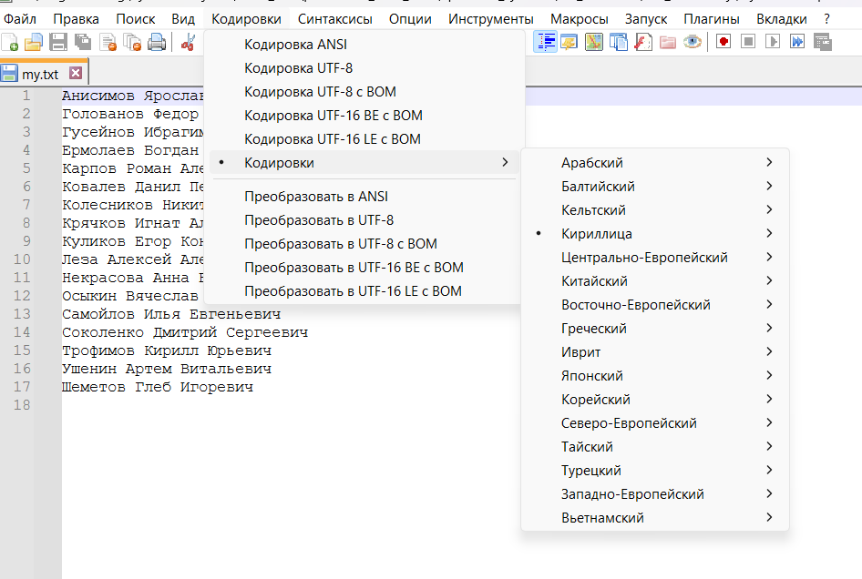

## Создать список фамилий студентов группы, используя пример 1. Отсортировать список в алфавитном порядке и сохранить его в новом файле.

####  Подсказка для перехода на диск D, если не хотите сидеть на C - введите просто в cmd `D:`. 

Вам нужно вручную в консоли вбить имена, я заранее подготовил файл `students.txt`, здесь группа ВКБ32 на 2024 год
1. Вставляем команду `COPY CON my.txt`
2. Вставляем текст (СTRL + SHIFT + V) - люди вашей группы
3. CTRL + Z, чтобы прекратить вставлять текст
4. Вставляем команду для сортировки `SORT students.txt > students-sorted.txt`


--- 

Если у Вас в файле после `COPY CON my.txt` пусто или null, то вводим в консоли следующее:

```
chcp 1251
```

И повторяем все пункты, которые были описаны выше, а потом открываем файл в Notepad++, кодировки менять не надо.
У меня вот конфигурация, которая представлена ниже на рисунке. 

