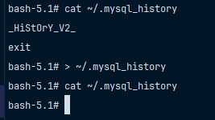

# Очистить историю команд пользователя, набираемых в утилите `mysql`

По умолчанию `MySQL` сохраняет команды сессий в `mysql_history`. 
Чтобы очистить историю команд, можно воспользоваться командой из-под `Linux`, которая представлена ниже: 

```bash
> ~/.mysql_history
```

