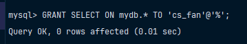

# Дать права пользователю на некоторый объект (объекты) в БД

Выдадим теперь право только на чтение одной таблицы базы данных у нашего пользователя, которого создали до этого. 
Для выполнения данного задания используйте команду, которая представлена ниже: 

```mysql
GRANT SELECT ON mydb.* TO 'cs_fan'@'%';
```

> [!NOTE]
> - Если вы хотите выдать права на другие действия, то тут просто будет через запятую. 
> Например, `GRANT SELECT, INSERT, UPDATE ON mydb.* TO 'cs_fan'@'%';`
> - Если же хотите выдать все права, то можно использовать данную команду: `GRANT ALL PRIVILEGES ON mydatabase.* TO 'cs_fan'@'%';`

После выполнения команды нужно обновить кэш, для этого используйте команду, которая представлена ниже: 

```mysql
FLUSH PRIVILEGES;
```

> [!IMPORTANT]
> В моем случае я создал из-под `Docker` базу данных `mydb`, так как такое название у меня находится под переменной `MYSQL_DATABASE` в `.env`

> [!NOTE]
> Здесь `%` означает, что пользователь может подключаться с любого хоста.
> Если нужно ограничить можно заменить на `IP` или `localhost`.

Результат выполнения команды представлен ниже на фотографии

