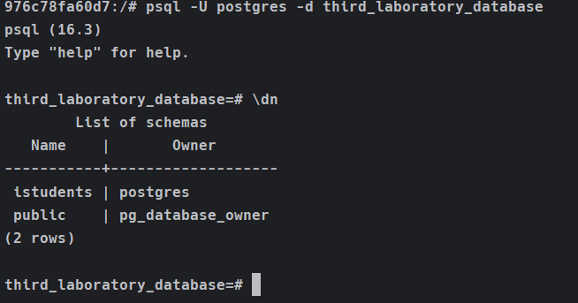

# Создать схему `istudents`

> [!IMPORTANT]
> - В данном случае схема автоматически создается, так как я прокидываю [данный файл](scripts/initdb/01_init_schemas.sql) в `docker-compose`

Для того чтобы создать схему, используется команда, которая представлена ниже: 

```postgresql
CREATE SCHEMA имя_схемы;
```

В нашем случае надо создать схему `istudents`: 

```postgresql
CREATE SCHEMA istudents;
```

### Как проверить, что схема создана? 

В начале нужно перейти в директорию, где находится данный `README.md`:

```bash
cd protection_in_databases/3/1
```

Теперь поднимаем контейнер:

```docker
docker compose --env-file .env up
```

Для этого войдите в контейнер, используя команду, которая представлена ниже:

```bash
docker exec -it postgres-lab-3-question-1 /bin/bash
```

Теперь войдите под учетной записи, которую создали.
В моем случае пользователь - `postgres`, пароль - `postgres`, база данных - `third_laboratory_database`.

```bash
psql -U postgres -d third_laboratory_database
```

> [!NOTE]
> Ниже для ввода спросят пароль для ввода. В моем случае, например, `postgres`. 

Теперь нам нужно выполнить команду, которая представлена ниже, чтобы просмотреть все схемы: 

```bash
\dn
```

