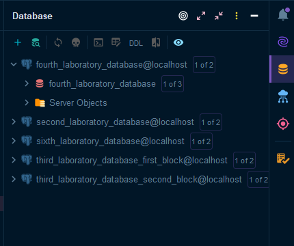
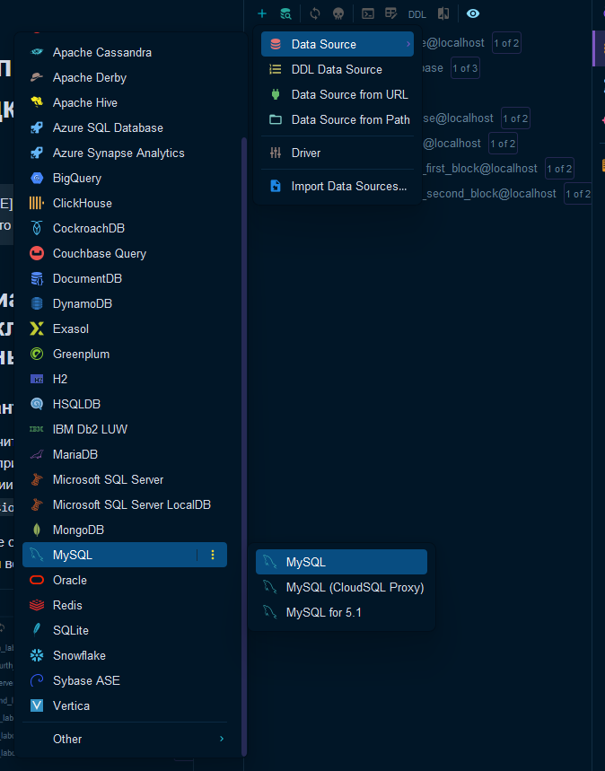
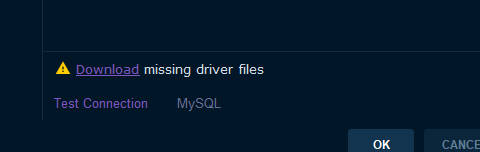
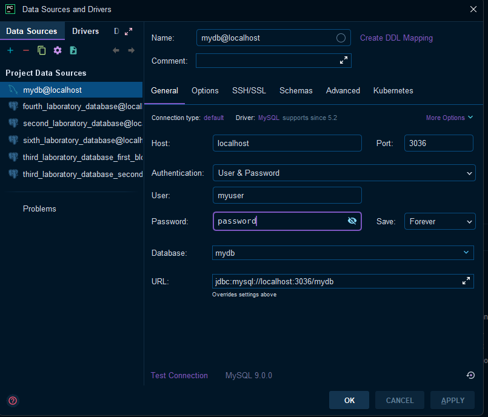
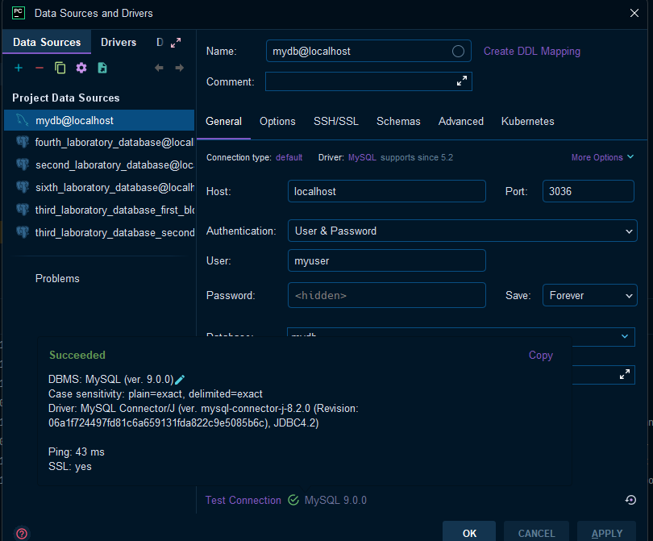
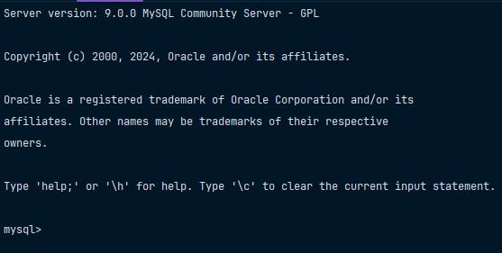

# Выполните подключение к БД

> [!NOTE]
> Гайд ниже представлен для тех, кто пользуется `Docker`

## Варианты подключения к базе данных

### Вариант 1 (GUI)

> [!IMPORTANT]
> - Предполагается, что у вас уже запущен `docker compose`
> - Ниже представлен гайд для продуктов `Jetbrains` в `Professional` издании.

Нажмите справа на значок базы данных, он такой вот желтый, как на рисунке ниже:



После этого нажимаем на `+` и выбираем нужный драйвер, как показано на фото ниже:



Скачайте драйвер, нажав на `Download`, как показано на рисунке ниже: 



Теперь нам нужно задать параметры для подключения. Ниже приведу фото какие у меня данные и где, чтобы Вы могли понять: 



При успешном подключении будет такое вот уведомление: 



### Вариант 2 (TUI)

> [!IMPORTANT]
> - Предполагается, что у вас уже запущен `docker compose`
> - Автор пользуется `PowerShell` от `Windows 11`

Для начала войдем в контейнер, используя команду, которая представлена ниже: 

```bash
docker exec -it first-laboratory-database /bin/bash
```

Теперь активируем командную оболочку `MySQL`, зайдя из-под `root`.

> [!IMPORTANT]
> Посмотрите, пожалуйста, значение переменной `MYSQL_DATABASE` в `.env`. В моем случае - это `mydb`

Для этого выполните команду, которая представлена ниже: 

```bash
mysql -u root -h localhost mydb -p
```

После этого введите пароль, который находится в `.env` под переменной `MYSQL_ROOT_PASSWORD`. 

Если вы видите такую консоль, как на фото снизу, то вы успешно выполнили подключение к базе данных. 




