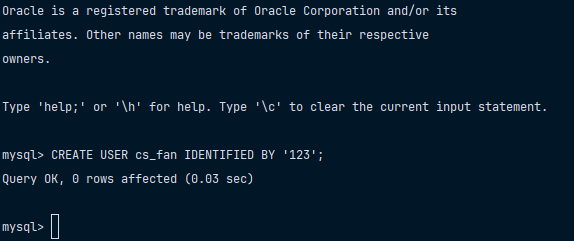

# Создать пользователя

Для создания пользователя в `MySQL` существует следующая команда: 

```mysql
CREATE USER user_account IDENTIFIED BY password;
```

Параметры данной команды:

- `user_account` - имя пользователя и хост (опционально). Например, `username@hostname` или же просто `username`
- `password` - пароль в виде строки для аутентификации пользователя. 

В моем случае я использовал команду, которая представлена ниже: 

```mysql
CREATE USER cs_fan IDENTIFIED BY '123';
```

В результате у вас должно получиться так, как представлено ниже на фото: 

