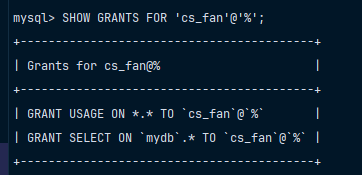

# Продемонстрировать, каким образом изменилась информация в системной таблице с описанием привилегий пользователя. 

> [!NOTE]
> Пожалуйста, убедитесь, что вы сделали `FLUSH`, как написано в прошлом задании. 

Чтобы вывести все права пользователя, выполните команду, которая представлена ниже.

```mysql
SHOW GRANTS FOR 'cs_fan'@'%';
```

> [!IMPORTANT]
> Вместо `cs_fan` может быть абсолютно другое иия, которое вы создали до этого. 
> Здесь в команде выше имя пользователя, которого я сам создал. 

В моем случае вывелось то, что представлено ниже на рисунке: 



> [!NOTE]
> `GRANT USAGE ON *.* TO 'cs_fan'@'%'` - это базовая привилегия, которая не даёт никаких реальных прав на выполнение операций с базой данных. 
> То есть, пользователь `cs_fan` получает минимальные "пустые" права, просто может подключиться к серверу, но ничего не может делать (ни читать, ни писать, ни управлять).

Если вам нужно показать привилегии всех пользователей, то используйте команду, которая представлена ниже: 

```mysql
SELECT * FROM information_schema.user_privileges;
```