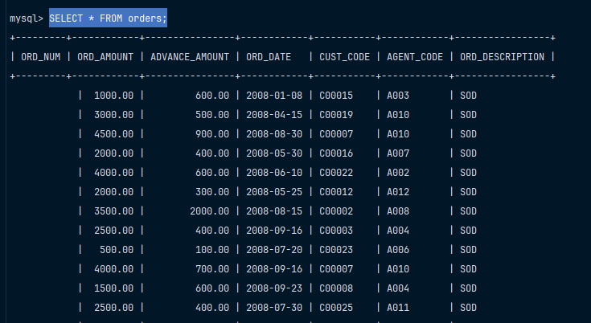
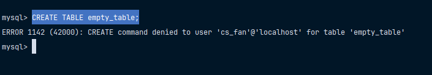

# Выполнить вход от имени созданного пользователя и продемонстрировать возможность просмотра и модификации данных в таблице, на которую ранее были предоставлены права

Теперь, чтобы выйти из сессии, нужно использовать комбинацию `CTRL + C`. 
После этого надо заново зайти в `Docker` контейнер. 

Для выполнения данной команды используйте: 

```bash
docker exec -it first-laboratory-database /bin/bash
```

Теперь нам нужно войти под пользователем `cs_fan`, которого я создал до этого. Для этого используйте команду, которая представлена ниже: 

```bash
mysql -u cs_fan -h localhost mydb -p
```

Теперь введите пароль, в моем случае это было: `StrongPassword123!`

Проверим права доступа. Для этого в начале просмотрим все таблицы, используя команду ниже: 

```mysql
SHOW TABLES;
```

Выберите любую таблицу для просмотра. Например, я захотел просмотреть данные в таблице `orders`.
В моем случае команда, которая представлена ниже успешно выполнилась и вывела данные. 

```mysql
SELECT * FROM orders;
```



А вот при попытке создать таблицу, используя команду ниже, выдает, что доступ запрещен.  

```mysql
CREATE TABLE empty_table;
```

