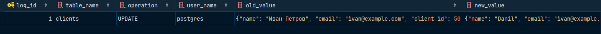

# Вариант 1

Настроить `pgAudit` для логирования операций `SELECT` и `INSERT` в таблице `clients`. 
Создать триггер для записи изменений в таблицу `audit_log` при выполнении `UPDATE` в `clients`.

> [!NOTE]
> Для запуска создайте `.env` файл, скопировав значения из `.env.example`.
> Потом выполните команду `docker compose up --build`, запустив `Docker Desktop` перед этим. 

> [!IMPORTANT]
> В `pgaudit` можно настраивать глобальные параметры и локальные параметры. 
> Глобальные описываются в `postgresql.conf`. 
> Но также есть поддержка создания через объекты, выдавая им осмотр на определенные записи. 
> Мною была обнаружена проблема, что даже при запрете `DELETE`, `UPDATE` `pgaudit` все равно их отслеживает. 
> Скорее всего это связано с версией софта, другого предположения нет почему не работает нормально. 

Тестовые операции для `UPDATE`:

```sql
UPDATE clients SET name = 'Danil' WHERE email='ivan@example.com';
```

Тестовые операции для `DELETE`:

```sql
DELETE FROM clients WHERE name = 'Danil';
```


Для проверки можно ещё вставить значения:

```sql
INSERT INTO clients (name, email) VALUES 
('Иван Петров', 'ivan@example.com'),
('Мария Сидорова', 'maria@example.com'),
('Алексей Иванов', 'alex@example.com');
```

Проверка `audit_log`:

```sql
SELECT * FROM audit_log;
```


