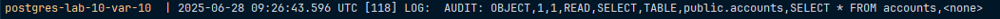
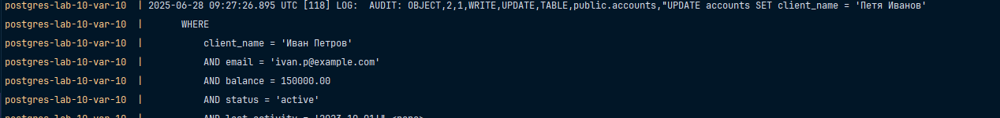
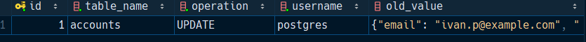
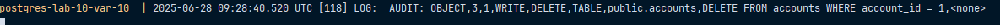
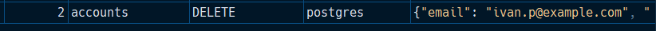
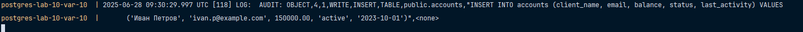

# Вариант 10

Настроить `pgAudit` для логирования всех операций (`SELECT`, `INSERT`, `UPDATE`, `DELETE`) в таблице `accounts`.
Создать триггер для записи изменений при `UPDATE` и `DELETE` в `accounts`, включая
все данные старой и новой строк в `audit_log`.

Проверим операцию `SELECT`, что она логгируется: 

```sql
SELECT * FROM accounts;
```



Проверим операцию `UPDATE`, что она логгируется и добавляется в `audit_log`:

```sql
UPDATE accounts SET client_name = 'Петя Иванов'
WHERE 
    client_name = 'Иван Петров'
    AND email = 'ivan.p@example.com'
    AND balance = 150000.00
    AND status = 'active'
    AND last_activity = '2023-10-01';
```





Проверим операцию `DELETE`, что она логгируется и добавляется в `audit_log`:

```sql
DELETE FROM accounts WHERE account_id = 1;
```





Проверим операцию `INSERT`, что она логгируется:

```sql
INSERT INTO accounts (client_name, email, balance, status, last_activity) VALUES
('Иван Петров', 'ivan.p@example.com', 150000.00, 'active', '2023-10-01');
```



