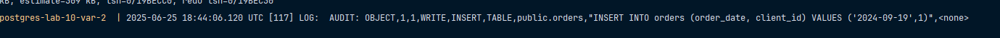

# Вариант 2

Настроить `pgAudit` для логирования всех операций (`SELECT`, `INSERT`, `UPDATE`, `DELETE`) в таблице `orders`.
Создать триггер, фиксирующий изменения в `orders` с сохранением старого значения в `audit_log`.

> [!IMPORTANT]
> Для запуска скопируйте значения из `.env` в `.env.example`, после этого выполните команду `docker compose up --build`.

Ничего не видно должно быть:

```sql
INSERT INTO clients (email, name) VALUES ('pupa@gmail.com','Danil Kovalev')
```

Должно быть видно:

```sql
INSERT INTO orders (order_date, client_id) VALUES ('2024-09-19',1)
```

