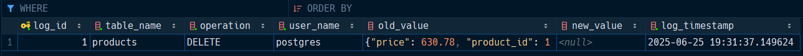
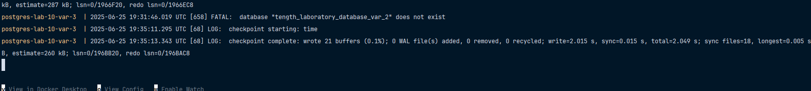
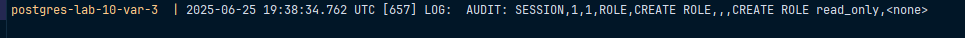

# Вариант 3

Включить логирование только административных операций (`CREATE`, `ALTER`, `DROP`) с помощью `pgAudit`. Создать триггер,
записывающий операции `DELETE` в таблице `products` в журнал `audit_log`.

> [!IMPORTANT]
> Для запуска скопируйте значения из `.env` в `.env.example`, после этого выполните команду `docker compose up --build`.

Исходя из [документации на `Github`](https://github.com/pgaudit/pgaudit?tab=readme-ov-file#pgauditrole), 
здесь можно настроить, но не получится игнорировать операции `GRANT`, `REVOKE`.

Примеры операции, что триггер работает:

```sql
DELETE FROM products WHERE product_name = 'cqwG';
```

Пример операции, что триггер ничего не сохраняет

```sql
INSERT INTO products (product_name, price) VALUES ('cqwG', 5000);
```





Примеры операций для создания роли: 

```sql
CREATE ROLE read_only;

CREATE ROLE app_user WITH LOGIN PASSWORD 'secret';

CREATE ROLE admin WITH SUPERUSER CREATEDB CREATEROLE;
```



Примеры операций для обновления роли:

```sql
ALTER ROLE app_user WITH PASSWORD 'new_secret';

ALTER ROLE read_only WITH LOGIN;

ALTER ROLE app_user VALID UNTIL '2026-01-01';

ALTER ROLE read_only RENAME TO reader;
```


Удаление ролей:

```sql
DROP ROLE app_user;

DROP ROLE reader, admin;
```

